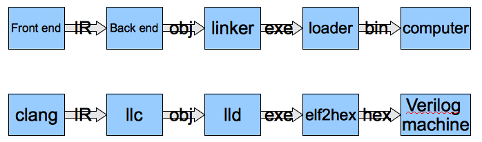

.. _sec-about:

About
=====

Authors
-------

.. figure:: ../Fig/Author_ChineseName.png
	:align: right

Chen Chung-Shu
	gamma_chen@yahoo.com.tw
	
	http://jonathan2251.github.io/web/index.html

Anoushe Jamshidi
	ajamshidi@gmail.com

Contributors
------------

Chen Wei-Ren, chenwj@iis.sinica.edu.tw, assisted with text and code formatting.

Chen Zhong-Cheng, who is the author of original cpu0 verilog code.

Acknowledgments
---------------

We would like to thank Sean Silva, silvas@purdue.edu, for his help, encouragement, and
assistance with the Sphinx document generator.  Without his help, this book would not 
have been finished and published online. We also thank those corrections from readers 
who make the book more accurate.

Support
--------

We get the kind help from LLVM development mail list, llvmdev@cs.uiuc.edu, 
even we don't know them. So, our experience is you are not 
alone and can get help from the development list members in working with the LLVM 
project. Some of them are:

Akira Hatanaka <ahatanak@gmail.com> in va_arg question answer.

Ulrich Weigand <Ulrich.Weigand@de.ibm.com> in AsmParser question answer.

Revision history
----------------

Version 3.4.1, Not release yet.
  Add ch9_4.cpp to lld test.

Version 3.4.0, Released January 9, 2014
  Porting to llvm 3.4 release.

Version 3.3.14, Released January 4, 2014
  lld support on iMac.
  Correct typing.

Version 3.3.13, Released December 27, 2013
  Update section Install sphinx on install.rst.
  Add Fig/llvmstructure/cpu0_arch.odp.

Version 3.3.12, Released December 25, 2013
  Correct typing error.
  Adjust Example Code.
  Add section Data operands DAGs of backendstructure.rst.
  Fix bug in instructions lb and lh of cpu0.v.
  Fix bug in itoa.cpp.
  Add ch7_2_2.cpp for othertype.rst.
  Add AsmParser reference web.

Version 3.3.11, Released December 11, 2013
  Add Figure Code generation and execution flow in about.rst.
  Update backendstructure.rst.
  Correct otherinst.rst.
  Decoration.
  Correct typing error.

Version 3.3.10, Released December 5, 2013
  Correct typing error.
  Dynamic linker in lld.rst.
  Correct errors came from old version of example code.
  lld.rst.

Version 3.3.9, Released November 22, 2013
  Add LLD introduction and Cpu0 static linker document in lld.rst.
  Fix the plt bug in elf2hex.h for dynamic linker.

Version 3.3.8, Released November 19, 2013
  Fix the reference file missing for make gh-page.

Version 3.3.7, Released November 17, 2013
  lld.rst documentation.
  Add cpu032I and cpu032II in `llc -mcpu`.
  Reference only for Chapter12_2.

Version 3.3.6, Released November 8, 2013
  Move example code from github to dropbox since the name is not work for 
  download example code.

Version 3.3.5, Released November 7, 2013
  Split the elf2hex code from modiified llvm-objdump.cpp to elf2hex.h.
  Fix bug for tail call setting in LowerCall().
  Fix bug for LowerCPLOAD().
  Update elf.rst.
  Fix typing error.
  Add dynamic linker support.
  Merge cpu0 Chapter12_1 and Chapter12_2 code into one, and identify each of 
  them by -mcpu=cpu0I and -mcpu=cpu0II.
  cpu0II.
  Update lld.rst for static linker.
  Change the name of example code from LLVMBackendTutorialExampleCode to lbdex.

Version 3.3.4, Released September 21, 2013
  Fix Chapter Global variables error for LUi instructions and the material move
  to Chapter Other data type.
  Update regression test items.

Version 3.3.3, Released September 20, 2013
  Add Chapter othertype

Version 3.3.2, Released September 17, 2013
  Update example code.
  Fix bug sext_inreg.
  Fix llvm-objdump.cpp bug to support global variable of .data.
  Update install.rst to run on llvm 3.3.  

Version 3.3.1, Released September 14, 2013
  Add load bool type in chapter 6.
  Fix chapter 4 error.
  Add interrupt function in cpu0i.v.
  Fix bug in alloc() support of Chapter 8 by adding code of spill $fp register. 
  Add JSUB texternalsym for memcpy function call of llvm auto reference.
  Rename cpu0i.v to cpu0s.v.
  Modify itoa.cpp.
  Cpu0 of lld.

Version 3.3.0, Released July 13, 2013
  Add Table: C operator ! corresponding IR of .bc and IR of DAG and Table: C 
  operator ! corresponding IR of Type-legalized selection DAG and Cpu0 
  instructions. Add explanation in section Full support %. 
  Add Table: Chapter 4 operators.
  Add Table: Chapter 3 .bc IR instructions.
  Rewrite Chapter 5 Global variables.
  Rewrite section Handle $gp register in PIC addressing mode.
  Add Large Frame Stack Pointer support.
  Add dynamic link section in elf.rst.
  Re-oganize Chapter 3.
  Re-oganize Chapter 8.
  Re-oganize Chapter 10.
  Re-oganize Chapter 11.
  Re-oganize Chapter 12.
  Fix bug that ret not $lr register.
  Porting to LLVM 3.3.

Version 3.2.15, Released June 12, 2013
	Porting to llvm 3.3.
	Rewrite section Support arithmetic instructions of chapter Adding arithmetic
	and local pointer support with the table adding.
	Add two sentences in Preface. 
	Add `llc -debug-pass` in section LLVM Code Generation Sequence.
	Remove section Adjust cpu0 instructions.
	Remove section Use cpu0 official LDI instead of ADDiu of Appendix-C.
Version 3.2.14, Released May 24, 2013
	Fix example code disappeared error.
Version 3.2.13, Released May 23, 2013
	Add sub-section "Setup llvm-lit on iMac" of Appendix A.
	Replace some code-block with literalinclude in \*.rst.
	Add Fig 9 of chapter Backend structure.
	Add section Dynamic stack allocation support of chapter Function call.
	Fix bug of Cpu0DelUselessJMP.cpp.
	Fix cpu0 instruction table errors.
Version 3.2.12, Released March 9, 2013
	Add section "Type of char and short int" of chapter 
	"Global variables, structs and arrays, other type".
Version 3.2.11, Released March 8, 2013
	Fix bug in generate elf of chapter "Backend Optimization".
Version 3.2.10, Released February 23, 2013
	Add chapter "Backend Optimization".
Version 3.2.9, Released February 20, 2013
	Correct the "Variable number of arguments" such as sum_i(int amount, ...) 
	errors. 
Version 3.2.8, Released February 20, 2013
	Add section llvm-objdump -t -r.
Version 3.2.7, Released February 14, 2013
	Add chapter Run backend.
	Add Icarus Verilog tool installation in Appendix A. 
Version 3.2.6, Released February 4, 2013
	Update CMP instruction implementation.
	Add llvm-objdump section.
Version 3.2.5, Released January 27, 2013
	Add "LLVMBackendTutorialExampleCode/llvm3.1".
	Add  section "Structure type support". 
	Change reference from Figure title to Figure number.
Version 3.2.4, Released January 17, 2013
	Update for LLVM 3.2.
	Change title (book name) from "Write An LLVM Backend Tutorial For Cpu0" to 
	"Tutorial: Creating an LLVM Backend for the Cpu0 Architecture".
Version 3.2.3, Released January 12, 2013
	Add chapter "Porting to LLVM 3.2".
Version 3.2.2, Released January 10, 2013
	Add section "Full support %" and section "Verify DIV for operator %".
Version 3.2.1, Released January 7, 2013
	Add Footnote for references.
	Reorganize chapters (Move bottom part of chapter "Global variable" to 
	chapter "Other instruction"; Move section "Translate into obj file" to 
	new chapter "Generate obj file". 
	Fix errors in Fig/otherinst/2.png and Fig/otherinst/3.png. 
Version 3.2.0, Released January 1, 2013
	Add chapter Function.
	Move Chapter "Installing LLVM and the Cpu0 example code" from beginning to 
	Appendix A.
	Add subsection "Install other tools on Linux".
	Add chapter ELF.
Version 3.1.2, Released December 15, 2012
	Fix section 6.1 error by add “def : Pat<(brcond RC:$cond, bb:$dst), 
	(JNEOp (CMPOp RC:$cond, ZEROReg), bb:$dst)>;” in last pattern.
	Modify section 5.5
	Fix bug Cpu0InstrInfo.cpp SW to ST.
	Correct LW to LD; LB to LDB; SB to STB.
Version 3.1.1, Released November 28, 2012
	Add Revision history.
	Correct ldi instruction error (replace ldi instruction with addiu from the 
	beginning and in the all example code).
	Move ldi instruction change from section of "Adjust cpu0 instruction and 
	support type of local variable pointer" to Section ”CPU0 
	processor architecture”.
	Correct some English & typing errors.

Licensing
---------
.. todo:: Add info about LLVM documentation licensing.

Preface
-------

The LLVM Compiler Infrastructure provides a versatile structure for creating new
backends. Creating a new backend should not be too difficult once you 
familiarize yourself with this structure. However, the available backend 
documentation is fairly high level and leaves out many details. This tutorial 
will provide step-by-step instructions to write a new backend for a new target 
architecture from scratch. 

We will use the Cpu0 architecture as an example to build our new backend. Cpu0 
is a simple RISC architecture that has been designed for educational purposes. 
More information about Cpu0, including its instruction set, is available 
`here <http://ccckmit.wikidot.com/ocs:cpu0>`_. The Cpu0 example code referenced in
this book can be found `here <http://jonathan2251.github.io/lbd/LLVMBackendTutorialExampleCode.tar.gz>`_.
As you progress from one chapter to the next, you will incrementally build the 
backend's functionality.

Since Cpu0 is a simple RISC CPU for educational purpose, it make the Cpu0 llvm 
backend code simple too and easy to learning. In addition, Cpu0 supply the 
Verilog source code that you can run on your PC or FPGA platform when you go to 
chapter Run backend.

This tutorial was written using the LLVM 3.1 Mips backend as a reference. Since 
Cpu0 is an educational architecture, it is missing some key pieces of 
documentation needed when developing a compiler, such as an Application Binary 
Interface (ABI). We implement our backend borrowing information from the Mips 
ABI as a guide. You may want to familiarize yourself with the relevant parts of 
the Mips ABI as you progress through this tutorial.

This document can be a tutorial of toolchain development for a new CPU 
architecture. Many programmer gradutated from school with the knowledges of 
Compiler as well as Computer architecture but is not an professional engineer 
in compiler or CPU design. This document is a material for these engineers to 
show them how to develop and real programming a toolchain as well as design a 
CPU based on the LLVM Open source structure and open source tool without pay 
any money to buy any software or hardware. Computer is the only device needed.

Finally, this book is not a compiler book in concept. It is for those readers 
have interested in extend compiler toolchain to support a new CPU based on llvm 
structure. To program 
on Linux OS, you program or write a driver without knowing every details. 
For example in a specific USB device driver programm on Linux plateform, he 
or she will try to understand the USB spec., linux USB subsystem and common 
device driver working model and api. 
In the same way, to extend functions from a large software like llvm umbrella 
project, you should find a way to reach the goal and ignore the details not on 
your way. 
Try to understand in details of every line of source code is not realistic if 
your project is extended function from a well defined software structure. 
It only make sense in rewriting the whole software structure.
Of course, if there are more llvm backend book or documents, then 
readers got the chance to know more about llvm by reading book or documents. 

Prerequisites
-------------
Readers should be comfortable with the C++ language and Object-Oriented 
Programming concepts. LLVM has been developed and implemented in C++, and it is 
written in a modular way so that various classes can be adapted and reused as 
often as possible.

Already having conceptual knowledge of how compilers work is a plus, and if you 
already have implemented compilers in the past you will likely have no trouble 
following this tutorial. As this tutorial will build up an LLVM backend 
step-by-step, we will introduce important concepts as necessary.

This tutorial references the following materials.  We highly recommend you read 
these documents to get a deeper understanding of what the tutorial is teaching:

`The Architecture of Open Source Applications Chapter on LLVM <http://www.aosabook.org/en/llvm.html>`_

`LLVM's Target-Independent Code Generation documentation <http://llvm.org/docs/CodeGenerator.html>`_

`LLVM's TableGen Fundamentals documentation <http://llvm.org/docs/TableGenFundamentals.html>`_

`LLVM's Writing an LLVM Compiler Backend documentation <http://llvm.org/docs/WritingAnLLVMBackend.html>`_

`Description of the Tricore LLVM Backend <http://www.opus.ub.uni-erlangen.de/opus/volltexte/2010/1659/pdf/tricore_llvm.pdf>`_

`Mips ABI document <http://www.linux-mips.org/pub/linux/mips/doc/ABI/mipsabi.pdf>`_

Outline of Chapters
-------------------

.. _about-f1: 

  Code generation and execution flow

The upper half of :num:`Figure #about-f1` is the computer program generated 
and executed flow. IR stands for Intermediate Representation. 
The lower half is this book flow of the toolchain extended implementation 
based on llvm. Except clang, the other blocks need to extended for a new 
backend development. The hex is the ascii from '0' to 'f' for 
hexadecimal value representation (4 bits of binary code representation) since 
the verilog language machine use it as input file.

This book include 10,000 lines of source code for

1. Step-by-step, create an llvm backend for the Cpu0 which beginning from a 
   CPU design for school teaching purpose in system programming. Chapter 2 to 
   12.
2. ELF linker for Cpu0 which extended from lld. Chapter 13.
3. elf2hex extended from llvm-objump. Chapter 13.
4. Cpu0 verilog source code. Chapter 11.

With these code, reader can run the generated code from the result of Cpu0 
llvm backend compiler, linker and elf2hex and see how it run on your computer. 
The pdf and epub are also available in the web. 
It is a tutorial for llvm backend developer but not for an expert. 
It also can be a material for those who have compiler and Computer 
Architecture book knowledges and like to know how to extend the llvm 
toolchain to support a new CPU.

:ref:`sec-llvmstructure`:

This chapter introduces the Cpu0 architecture, a high-level view of LLVM, and how Cpu0 
will be targeted in in an LLVM backend. This chapter will run you through the initial 
steps of building the backend, including initial work on the target description (td), 
setting up cmake and LLVMBuild files, and target registration. Around 750 lines of source 
code are added by the end of this chapter.

:ref:`sec-backendstructure`:

This chapter highlights the structure of an LLVM backend using by UML graphs, and we 
continue to build the Cpu0 backend. Around 2300 lines of source code are added, 
most of which are common from one LLVM backends to another, regardless of the 
target architecture. By the end of this chapter, the Cpu0 LLVM backend will support 
less than ten instructions to generate some initial assembly output. 

:ref:`sec-addingmoresupport`:

Over ten C operators and their corresponding LLVM IR instructions are introduced in this 
chapter. Around 345 lines of source code, mostly in .td Target Description files, are 
added. With these 345 lines, the backend can now translate the **+, -, \*, /, &, |, ^, 
<<, >>, !** and **%** C operators into the appropriate Cpu0 assembly code. Use of the 
``llc`` debug option and of **Graphviz** as a debug tool are introduced in this chapter.

:ref:`sec-genobjfiles`:

Object file generation support for the Cpu0 backend is added in this chapter, as the 
Target Registration structure is introduced. With 700 lines of additional code, 
the Cpu0 backend can now generate big and little endian object files.

:ref:`sec-globalvars`:

Global variable, struct and array support, char and short int, are added in this chapter. 
About 300 lines of source code are added to do this. The Cpu0 supports PIC and static 
addressing mode, both of which area explained as their functionality is implemented.

:ref:`sec-othertypesupport`:

In addition to type int, other data type like pointer, char, bool, long long, 
structure and array are added in this chapter.

:ref:`sec-controlflow`:

Support for the **if, else, while, for, goto** flow control statements are 
added in this chapter. Around 150 lines of source code added.

:ref:`sec-funccall`:

This chapter details the implementation of function calls in the Cpu0 backend. The stack 
frame, handling incoming & outgoing arguments, and their corresponding standard LLVM 
functions are introduced. Over 700 lines of source code are added.

:ref:`sec-elf`:

This chapter details Cpu0 support for the well-known ELF object file format. The ELF 
format and binutils tools are not a part of LLVM, but are introduced.  This chapter 
details how to use the ELF tools to verify and analyze the object files created by the 
Cpu0 backend. The ``llvm-objdump -d`` support for Cpu0 which translate elf into hex 
file format is added in the last section.

:ref:`sec-runbackend`:

Add AsmParser support for translate hand code assembly language into obj first. 
Next, design the CPU0 backend with Verilog language of Icarus tool. 
Finally feed the hex file which generated by llvm-objdump and see the CPU0 
running result.

:ref:`sec-optimize`:

Introduce how to do backend optimization by a simple effective example, and 
extends Cpu0 instruction sets to be a efficient RISC CPU.

:ref:`sec-lld`:

Develop ELF linker for Cpu0 backend based on lld project.  

:ref:`sec-appendix-installing`:

Details how to set up the LLVM source code, development tools, and environment
setting for Mac OS X and Linux platforms.

