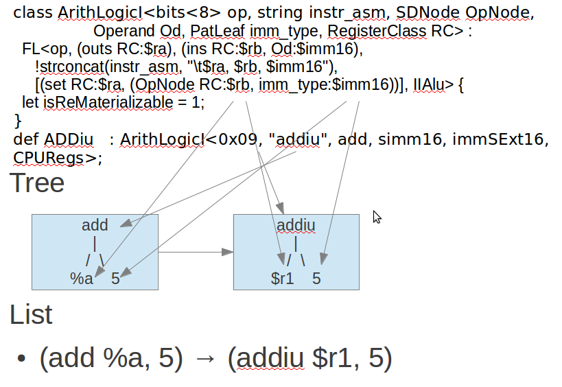

.. _sec-backendstructure:

Backend structure
==================

This chapter introduce the back end class inherit tree and class members first. 
Next, following the back end structure, adding individual class implementation 
in each section. 
There are compiler knowledge like DAG (Directed-Acyclic-Graph) and instruction 
selection needed in this chapter. 
This chapter explains these knowledge just when needed. 
At the end of this chapter, we will have a back end to compile llvm 
intermediate code into cpu0 assembly code.

Many code are added in this chapter. They almost are common in every back end 
except the back end name (cpu0 or mips ...). Actually, we copy almost all the 
code from mips and replace the name with cpu0. Please focus on the classes 
relationship in this backend structure. Once knowing the structure, you can 
create your backend structure as quickly as we did, even though there are 3000 
lines of code in this chapter.

TargetMachine structure
-----------------------

Your back end should define a TargetMachine class, for example, we define the 
Cpu0TargetMachine class. 
Cpu0TargetMachine class contains it's own instruction class, frame/stack class, 
DAG (Directed-Acyclic-Graph) class, and register class. 
The Cpu0TargetMachine contents as follows,

.. rubric:: include/llvm/Target/Cpu0TargetMachine.h
.. code-block:: c++

  //- TargetMachine.h 
  class TargetMachine { 
    TargetMachine(const TargetMachine &) LLVM_DELETED_FUNCTION;
    void operator=(const TargetMachine &) LLVM_DELETED_FUNCTION;
  ...
  public: 
    // Interfaces to the major aspects of target machine information: 
    // -- Instruction opcode and operand information 
    // -- Pipelines and scheduling information 
    // -- Stack frame information 
    // -- Selection DAG lowering information 
    // 
    virtual const TargetInstrInfo         *getInstrInfo() const { return 0; } 
    virtual const TargetFrameLowering *getFrameLowering() const { return 0; } 
    virtual const TargetLowering    *getTargetLowering() const { return 0; } 
    virtual const TargetSelectionDAGInfo *getSelectionDAGInfo() const{ return 0; } 
    virtual const DataLayout             *getDataLayout() const { return 0; } 
    ... 
    /// getSubtarget - This method returns a pointer to the specified type of 
    /// TargetSubtargetInfo.  In debug builds, it verifies that the object being 
    /// returned is of the correct type. 
    template<typename STC> const STC &getSubtarget() const { 
    return *static_cast<const STC*>(getSubtargetImpl()); 
    } 
  
  } 
  ...
  class LLVMTargetMachine : public TargetMachine { 
  protected: // Can only create subclasses. 
    LLVMTargetMachine(const Target &T, StringRef TargetTriple, 
            StringRef CPU, StringRef FS, TargetOptions Options, 
            Reloc::Model RM, CodeModel::Model CM, 
            CodeGenOpt::Level OL); 
    ... 
  }; 


.. rubric:: LLVMBackendTutorialExampleCode/Chapter3_1/Cpu0TargetMachine.h
.. literalinclude:: ../LLVMBackendTutorialExampleCode/Chapter3_1/Cpu0TargetMachine.h
    :linenos:

  
.. rubric:: include/llvm/Target/TargetInstInfo.h
.. code-block:: c++

  class TargetInstrInfo : public MCInstrInfo { 
    TargetInstrInfo(const TargetInstrInfo &) LLVM_DELETED_FUNCTION;
    void operator=(const TargetInstrInfo &) LLVM_DELETED_FUNCTION;
  public: 
    ... 
  }
  ...
  class TargetInstrInfoImpl : public TargetInstrInfo { 
  protected: 
    TargetInstrInfoImpl(int CallFrameSetupOpcode = -1, 
              int CallFrameDestroyOpcode = -1) 
    : TargetInstrInfo(CallFrameSetupOpcode, CallFrameDestroyOpcode) {} 
  public: 
    ... 
  } 
  
.. rubric:: cmake_debug_build/lib/Target/Cpu0/Cpu0GenInstInfo.inc
.. code-block:: c++

  //- Cpu0GenInstInfo.inc which generate from Cpu0InstrInfo.td 
  #ifdef GET_INSTRINFO_HEADER 
  #undef GET_INSTRINFO_HEADER 
  namespace llvm { 
  struct Cpu0GenInstrInfo : public TargetInstrInfoImpl { 
    explicit Cpu0GenInstrInfo(int SO = -1, int DO = -1); 
  }; 
  } // End llvm namespace 
  #endif // GET_INSTRINFO_HEADER 
  
  #define GET_INSTRINFO_HEADER 
  #include "Cpu0GenInstrInfo.inc" 
  //- Cpu0InstInfo.h 
  class Cpu0InstrInfo : public Cpu0GenInstrInfo { 
    Cpu0TargetMachine &TM; 
  public: 
    explicit Cpu0InstrInfo(Cpu0TargetMachine &TM); 
  };

.. _backendstructure-f1: 
.. figure:: ../Fig/backendstructure/1.png
  :align: center

  TargetMachine class diagram 1

The Cpu0TargetMachine inherit tree is TargetMachine <- LLVMTargetMachine <- 
Cpu0TargetMachine. 
Cpu0TargetMachine has class Cpu0Subtarget, Cpu0InstrInfo, Cpu0FrameLowering, 
Cpu0TargetLowering and Cpu0SelectionDAGInfo. 
Class Cpu0Subtarget, Cpu0InstrInfo, Cpu0FrameLowering, Cpu0TargetLowering and 
Cpu0SelectionDAGInfo are inherited from parent class TargetSubtargetInfo, 
TargetInstrInfo, TargetFrameLowering, TargetLowering and TargetSelectionDAGInfo.

:num:`Figure #backendstructure-f1` shows Cpu0TargetMachine inherit tree and it's 
Cpu0InstrInfo class inherit tree. 
Cpu0TargetMachine contains Cpu0InstrInfo and ... other class. 
Cpu0InstrInfo contains Cpu0RegisterInfo class, RI. Cpu0InstrInfo.td and 
Cpu0RegisterInfo.td will generate Cpu0GenInstrInfo.inc and 
Cpu0GenRegisterInfo.inc which contain some member functions implementation for 
class Cpu0InstrInfo and Cpu0RegisterInfo.

:num:`Figure #backendstructure-f2` as below shows Cpu0TargetMachine contains 
class 
TSInfo: Cpu0SelectionDAGInfo, FrameLowering: Cpu0FrameLowering, Subtarget: 
Cpu0Subtarget and TLInfo: Cpu0TargetLowering.

.. _backendstructure-f2:  
.. figure:: ../Fig/backendstructure/2.png
  :align: center

  TargetMachine class diagram 2

.. _backendstructure-f3: 
.. figure:: ../Fig/backendstructure/3.png
  :align: center

  TargetMachine members and operators

:num:`Figure #backendstructure-f3` shows some members and operators (member function) 
of the parent class TargetMachine's. 
:num:`Figure #backendstructure-f4` as below shows some members of class InstrInfo, 
RegisterInfo and TargetLowering. 
Class DAGInfo is skipped here.

.. _backendstructure-f4: 
.. figure:: ../Fig/backendstructure/4.png
  :align: center

  Other class members and operators

Benefit from the inherit tree structure, we just need to implement few code in 
instruction, frame/stack, select DAG class. 
Many code implemented by their parent class. 
The llvm-tblgen generate Cpu0GenInstrInfo.inc from Cpu0InstrInfo.td. 
Cpu0InstrInfo.h extract those code it need from Cpu0GenInstrInfo.inc by define 
“#define GET_INSTRINFO_HEADER”. 
Following is the code fragment from Cpu0GenInstrInfo.inc. 
Code between “#if def  GET_INSTRINFO_HEADER” and “#endif // GET_INSTRINFO_HEADER” 
will be extracted by Cpu0InstrInfo.h.

.. rubric:: cmake_debug_build/lib/Target/Cpu0/Cpu0GenInstInfo.inc
.. code-block:: c++

  //- Cpu0GenInstInfo.inc which generate from Cpu0InstrInfo.td 
  #ifdef GET_INSTRINFO_HEADER 
  #undef GET_INSTRINFO_HEADER 
  namespace llvm { 
  struct Cpu0GenInstrInfo : public TargetInstrInfoImpl { 
    explicit Cpu0GenInstrInfo(int SO = -1, int DO = -1); 
  }; 
  } // End llvm namespace 
  #endif // GET_INSTRINFO_HEADER 

Reference Write An LLVM Backend web site [#]_.

Now, the code in Chapter3_1/ add class Cpu0TargetMachine(Cpu0TargetMachine.h and 
cpp), Cpu0Subtarget (Cpu0Subtarget.h and .cpp), Cpu0InstrInfo (Cpu0InstrInfo.h 
and .cpp), Cpu0FrameLowering (Cpu0FrameLowering.h and .cpp), Cpu0TargetLowering 
(Cpu0ISelLowering.h and .cpp) and Cpu0SelectionDAGInfo ( Cpu0SelectionDAGInfo.h 
and .cpp). 
CMakeLists.txt  modified with those new added \*.cpp as follows,

.. rubric:: LLVMBackendTutorialExampleCode/Chapter3_1/CMakeLists.txt
.. literalinclude:: ../LLVMBackendTutorialExampleCode/Chapter3_1/CMakeLists.txt
    :start-after: add_public_tablegen_target
    :end-before: Should match with
    :linenos:


Please take a look for Chapter3_1 code. 
After that, building Chapter3_1 by make as chapter 2 (of course, you should remove old 
src/lib/Target/Cpu0 and replace with src/lib/Target/Cpu0/LLVMBackendTutorialExampleCode/Chapter3_1/). 
You can remove cmake_debug_build/lib/Target/Cpu0/\*.inc before do “make” to ensure your code 
rebuild completely. 
By remove \*.inc, all files those have included .inc will be rebuild, then your 
Target library will regenerate. 
Command as follows,

.. code-block:: bash

  118-165-78-230:cmake_debug_build Jonathan$ rm -rf lib/Target/Cpu0/*


Add RegisterInfo
----------------

As depicted in :num:`Figure #backendstructure-f1`, the Cpu0InstrInfo class should 
contains Cpu0RegisterInfo. 
So Chapter3_2/ add Cpu0RegisterInfo class (Cpu0RegisterInfo.h, 
Cpu0RegisterInfo.cpp), and Cpu0RegisterInfo class in files Cpu0InstrInfo.h, 
Cpu0InstrInfo.cpp, Cpu0TargetMachine.h, and modify CMakeLists.txt as follows,

.. rubric:: LLVMBackendTutorialExampleCode/Chapter3_2/Cpu0RegisterInfo.h
.. literalinclude:: ../LLVMBackendTutorialExampleCode/Chapter3_2/Cpu0RegisterInfo.h
    :linenos:

.. rubric:: LLVMBackendTutorialExampleCode/Chapter3_2/Cpu0RegisterInfo.cpp
.. literalinclude:: ../LLVMBackendTutorialExampleCode/Chapter3_2/Cpu0RegisterInfo.cpp
    :linenos:

.. rubric:: LLVMBackendTutorialExampleCode/Chapter3_2/Cpu0InstrInfo.h
.. literalinclude:: ../LLVMBackendTutorialExampleCode/Chapter3_2/Cpu0InstrInfo.h
    :linenos:

.. rubric:: LLVMBackendTutorialExampleCode/Chapter3_2/Cpu0InstrInfo.cpp
.. literalinclude:: ../LLVMBackendTutorialExampleCode/Chapter3_2/Cpu0InstrInfo.cpp
    :linenos:

.. rubric:: LLVMBackendTutorialExampleCode/Chapter3_2/Cpu0TargetMachine.h
.. literalinclude:: ../LLVMBackendTutorialExampleCode/Chapter3_2/Cpu0TargetMachine.h
    :start-after: return &DL;
    :end-before: getTargetLowering
    :linenos:

.. code-block:: c++
  
  # CMakeLists.txt 
  ...
  add_llvm_target(Cpu0CodeGen 
    ...
    Cpu0RegisterInfo.cpp 
    ...
    )

Now, let's replace Chapter3_1/ with Chapter3_2/ of adding register class definition 
as command below and rebuild. 

.. code-block:: bash

  118-165-75-57:ExampleCode Jonathan$ pwd
  /Users/Jonathan/llvm/test/src/lib/Target/Cpu0/LLVMBackendTutorialExampleCode
  118-165-75-57:LLVMBackendTutorialExampleCode Jonathan$ sh removecpu0.sh 
  118-165-75-57:LLVMBackendTutorialExampleCode Jonathan$ cp -rf Chapter3_2/
  * ../.
  
After that, let's try to run the ``llc`` compile command to see what happen,

.. code-block:: bash

  118-165-78-230:InputFiles Jonathan$ /Users/Jonathan/llvm/test/cmake_debug_build/
  bin/Debug/llc -march=cpu0 -relocation-model=pic -filetype=asm ch3.bc -o 
  ch3.cpu0.s
  Assertion failed: (AsmInfo && "MCAsmInfo not initialized." "Make sure you includ
  ...


The errors say that we have not Target AsmPrinter. 
Let's add it in next section.


Add AsmPrinter
--------------

Chapter3_3/cpu0 contains the Cpu0AsmPrinter definition. First, we add definitions in 
Cpu0.td to support AssemblyWriter. 
Cpu0.td is added with the following fragment,

.. rubric:: LLVMBackendTutorialExampleCode/Chapter3_3/Cpu0.td
.. literalinclude:: ../LLVMBackendTutorialExampleCode/Chapter3_3/Cpu0.td
    :start-after: "Cpu032 ISA Support"
    :linenos:


As comments indicate, it will generate Cpu0GenAsmWrite.inc which is included 
by Cpu0InstPrinter.cpp. 
Cpu0GenAsmWrite.inc has the implementation of 
Cpu0InstPrinter::printInstruction() and Cpu0InstPrinter::getRegisterName(). 
Both of these functions can be auto-generated from the information we defined 
in Cpu0InstrInfo.td and Cpu0RegisterInfo.td. 
To let these two functions work in our code, the only thing need to do is add a 
class Cpu0InstPrinter and include them.

File Chapter3_3/Cpu0/InstPrinter/Cpu0InstPrinter.cpp include Cpu0GenAsmWrite.inc and 
call the auto-generated functions as follows,

.. rubric:: LLVMBackendTutorialExampleCode/Chapter3_3/InstPrinter/Cpu0InstPrinter.h
.. literalinclude:: ../LLVMBackendTutorialExampleCode/Chapter3_3/InstPrinter/Cpu0InstPrinter.h
    :linenos:

.. rubric:: LLVMBackendTutorialExampleCode/Chapter3_3/InstPrinter/Cpu0InstPrinter.cpp
.. literalinclude:: ../LLVMBackendTutorialExampleCode/Chapter3_3/InstPrinter/Cpu0InstPrinter.cpp
    :linenos:


Next, Cpu0MCInstLower (Cpu0MCInstLower.h, Cpu0MCInstLower.cpp), as well as 
Cpu0BaseInfo.h, 
Cpu0FixupKinds.h and Cpu0MCAsmInfo (Cpu0MCAsmInfo.h, Cpu0MCAsmInfo.cpp) in 
sub-directory MCTargetDesc as follows,

.. rubric:: LLVMBackendTutorialExampleCode/Chapter3_3/Cpu0MCInstLower.h
.. literalinclude:: ../LLVMBackendTutorialExampleCode/Chapter3_3/Cpu0MCInstLower.h
    :linenos:

.. rubric:: LLVMBackendTutorialExampleCode/Chapter3_3/Cpu0MCInstLower.cpp
.. literalinclude:: ../LLVMBackendTutorialExampleCode/Chapter3_3/Cpu0MCInstLower.cpp
    :linenos:

.. rubric:: LLVMBackendTutorialExampleCode/Chapter3_3/MCTargetDesc/Cpu0BaseInfo.h
.. literalinclude:: ../LLVMBackendTutorialExampleCode/Chapter3_3/MCTargetDesc/Cpu0BaseInfo.h
    :linenos:

.. rubric:: LLVMBackendTutorialExampleCode/Chapter3_3/MCTargetDesc/Cpu0FixupKinds.h
.. literalinclude:: ../LLVMBackendTutorialExampleCode/Chapter3_3/MCTargetDesc/Cpu0FixupKinds.h
    :linenos:

.. rubric:: LLVMBackendTutorialExampleCode/Chapter3_3/MCTargetDesc/Cpu0MCAsmInfo.h
.. literalinclude:: ../LLVMBackendTutorialExampleCode/Chapter3_3/MCTargetDesc/Cpu0MCAsmInfo.h
    :linenos:

.. rubric:: LLVMBackendTutorialExampleCode/Chapter3_3/MCTargetDesc/Cpu0MCAsmInfo.cpp
.. literalinclude:: ../LLVMBackendTutorialExampleCode/Chapter3_3/MCTargetDesc/Cpu0MCAsmInfo.cpp
    :linenos:


Finally, add code in Cpu0MCTargetDesc.cpp to register Cpu0InstPrinter as 
follows,

.. rubric:: LLVMBackendTutorialExampleCode/MCTargetDesc/Cpu0MCTargetDesc.cpp
.. literalinclude:: ../LLVMBackendTutorialExampleCode/Chapter3_3/MCTargetDesc/Cpu0MCTargetDesc.cpp
    :start-after: using namespace llvm
    :linenos:

Now, it's time to work with AsmPrinter. According section 
"section Target Registration" [#]_, we can register our AsmPrinter when we need it 
as the following function of LLVMInitializeCpu0AsmPrinter(),

.. rubric:: LLVMBackendTutorialExampleCode/Chapter3_3/Cpu0AsmPrinter.h
.. literalinclude:: ../LLVMBackendTutorialExampleCode/Chapter3_3/Cpu0AsmPrinter.h
    :linenos:

.. rubric:: LLVMBackendTutorialExampleCode/Chapter3_3/Cpu0AsmPrinter.cpp
.. literalinclude:: ../LLVMBackendTutorialExampleCode/Chapter3_3/Cpu0AsmPrinter.cpp
    :linenos:


The dynamic register mechanism is a good idea, right.

Except add the new .cpp files to CMakeLists.txt, please remember to add 
subdirectory InstPrinter, enable asmprinter, add libraries AsmPrinter and 
Cpu0AsmPrinter to LLVMBuild.txt as follows,

.. rubric:: LLVMBackendTutorialExampleCode/Chapter3_3/LLVMBuild.txt
.. code-block:: c++

  //  LLVMBuild.txt
  [common] 
  subdirectories = InstPrinter MCTargetDesc TargetInfo 
  
  [component_0] 
  ...
  # Please enable asmprinter
  has_asmprinter = 1 
  ...
  
  [component_1] 
  # Add AsmPrinter Cpu0AsmPrinter
  required_libraries = AsmPrinter CodeGen Core MC Cpu0AsmPrinter Cpu0Desc  
                       Cpu0Info SelectionDAG Support Target

Now, run Chapter3_3/Cpu0 for AsmPrinter support, will get error message as follows,

.. code-block:: bash

  118-165-78-230:InputFiles Jonathan$ /Users/Jonathan/llvm/test/cmake_debug_build/
  bin/Debug/llc -march=cpu0 -relocation-model=pic -filetype=asm ch3.bc -o 
  ch3.cpu0.s
  /Users/Jonathan/llvm/test/cmake_debug_build/bin/Debug/llc: target does not 
  support generation of this file type!

The ``llc`` fails to compile IR code into machine code since we didn't implement 
class Cpu0DAGToDAGISel. Before the implementation, we will introduce the LLVM 
Code Generation Sequence, DAG, and LLVM instruction selection in next 3 
sections.

LLVM Code Generation Sequence
-----------------------------

Following diagram came from tricore_llvm.pdf.

.. _backendstructure-f5: 
.. figure:: ../Fig/backendstructure/5.png
  :align: center

  tricore_llvm.pdf: Code generation sequence. On the path from LLVM code to 
  assembly code, numerous passes are run through and several data structures 
  are used to represent the intermediate results.

LLVM is a Static Single Assignment (SSA) based representation. 
LLVM provides an infinite virtual registers which can hold values of primitive 
type (integral, floating point, or pointer values). 
So, every operand can save in different virtual register in llvm SSA 
representation. 
Comment is “;” in llvm representation. 
Following is the llvm SSA instructions.

.. code-block:: c++

  store i32 0, i32* %a  ; store i32 type of 0 to virtual register %a, %a is
              ;  pointer type which point to i32 value
  store i32 %b, i32* %c ; store %b contents to %c point to, %b isi32 type virtual
              ;  register, %c is pointer type which point to i32 value.
  %a1 = load i32* %a    ; load the memory value where %a point to and assign the
              ;  memory value to %a1
  %a3 = add i32 %a2, 1  ; add %a2 and 1 and save to %a3

We explain the code generation process as below. 
If you don't feel comfortable, please check tricore_llvm.pdf section 4.2 first. 
You can  read “The LLVM Target-Independent Code Generator” from [#]_ 
and “LLVM Language Reference Manual” from [#]_ 
before go ahead, but we think read section 
4.2 of tricore_llvm.pdf is enough. 
We suggest you read the web site documents as above only when you are still not 
quite understand, even though you have read the articles of this section and 
next 2 sections for DAG and Instruction Selection.

1. Instruction Selection

.. code-block:: c++

  // In this stage, transfer the llvm opcode into machine opcode, but the operand
  //  still is llvm virtual operand.
      store i16 0, i16* %a // store 0 of i16 type to where virtual register %a
                 //  point to
  =>  addiu i16 0, i32* %a

2. Scheduling and Formation

.. code-block:: c++

  // In this stage, reorder the instructions sequence for optimization in
  //  instructions cycle or in register pressure.
      st i32 %a, i16* %b,  i16 5 // st %a to *(%b+5)
      st %b, i32* %c, i16 0
      %d = ld i32* %c
  
  // Transfer above instructions order as follows. In RISC like Mips the ld %c use
  //  the previous instruction st %c, must wait more than 1
  // cycles. Meaning the ld cannot follow st immediately.
  =>  st %b, i32* %c, i16 0
      st i32 %a, i16* %b,  i16 5
      %d = ld i32* %c, i16 0
  // If without reorder instructions, a instruction nop which do nothing must be
  //  filled, contribute one instruction cycle more than optimization. (Actually,
  //  Mips is scheduled with hardware dynamically and will insert nop between st
  //  and ld instructions if compiler didn't insert nop.)
      st i32 %a, i16* %b,  i16 5
      st %b, i32* %c, i16 0
      nop
      %d = ld i32* %c, i16 0
  
  // Minimum register pressure
  //  Suppose %c is alive after the instructions basic block (meaning %c will be
  //  used after the basic block), %a and %b are not alive after that.
  // The following no reorder version need 3 registers at least
      %a = add i32 1, i32 0
      %b = add i32 2, i32 0
      st %a,  i32* %c, 1
      st %b,  i32* %c, 2
  
  // The reorder version need 2 registers only (by allocate %a and %b in the same
  //  register)
  => %a = add i32 1, i32 0
      st %a,  i32* %c, 1
      %b = add i32 2, i32 0
      st %b,  i32* %c, 2

3. SSA-based Machine Code Optimization

    For example, common expression remove, shown in next section DAG.
  
4. Register Allocation

    Allocate real register for virtual register.
  
5. Prologue/Epilogue Code Insertion

    Explain in section Add Prologue/Epilogue functions
  
6. Late Machine Code Optimizations

    Any “last-minute” peephole optimizations of the final machine code can be 
    applied during this phase. 
    For example, replace x = x * 2 by x = x < 1 for integer operand.
  
7. Code Emission
    Finally, the completed machine code is emitted. For static compilation, 
    the end result is an assembly code file; for JIT compilation, the opcodes 
    of the machine instructions are written into memory. 

The llvm code generation sequence also can be obtained by 
``llc -debug-pass=Structure`` as the following. The first 4 code generation 
sequences from :num:`Figure #backendstructure-f5` are in the 
**'DAG->DAG Pattern Instruction Selection'** of the ``llc -debug-pass=Structure`` 
displayed. The order of Peephole Optimizations and Prologue/Epilogue Insertion
is inconsistent in them (please check the * in the following). 
No need to bother since the the LLVM is under development and changed all the 
time. 

.. code-block:: bash

  118-165-79-200:InputFiles Jonathan$ llc --help-hidden
  OVERVIEW: llvm system compiler
  
  USAGE: llc [options] <input bitcode>
  
  OPTIONS:
  ...
    -debug-pass                             - Print PassManager debugging information
      =None                                 -   disable debug output
      =Arguments                            -   print pass arguments to pass to 'opt'
      =Structure                            -   print pass structure before run()
      =Executions                           -   print pass name before it is executed
      =Details                              -   print pass details when it is executed
  
  118-165-79-200:InputFiles Jonathan$ llc -march=mips -debug-pass=Structure ch3.bc
  ...
  Target Library Information
  Target Transform Info
  Data Layout
  Target Pass Configuration
  No Alias Analysis (always returns 'may' alias)
  Type-Based Alias Analysis
  Basic Alias Analysis (stateless AA impl)
  Create Garbage Collector Module Metadata
  Machine Module Information
  Machine Branch Probability Analysis
    ModulePass Manager
      FunctionPass Manager
        Preliminary module verification
        Dominator Tree Construction
        Module Verifier
        Natural Loop Information
        Loop Pass Manager
          Canonicalize natural loops
        Scalar Evolution Analysis
        Loop Pass Manager
          Canonicalize natural loops
          Induction Variable Users
          Loop Strength Reduction
        Lower Garbage Collection Instructions
        Remove unreachable blocks from the CFG
        Exception handling preparation
        Optimize for code generation
        Insert stack protectors
        Preliminary module verification
        Dominator Tree Construction
        Module Verifier
        Machine Function Analysis
        Natural Loop Information
        Branch Probability Analysis
      * MIPS DAG->DAG Pattern Instruction Selection
        Expand ISel Pseudo-instructions
        Tail Duplication
        Optimize machine instruction PHIs
        MachineDominator Tree Construction
        Slot index numbering
        Merge disjoint stack slots
        Local Stack Slot Allocation
        Remove dead machine instructions
        MachineDominator Tree Construction
        Machine Natural Loop Construction
        Machine Loop Invariant Code Motion
        Machine Common Subexpression Elimination
        Machine code sinking
      * Peephole Optimizations
        Process Implicit Definitions
        Remove unreachable machine basic blocks
        Live Variable Analysis
        Eliminate PHI nodes for register allocation
        Two-Address instruction pass
        Slot index numbering
        Live Interval Analysis
        Debug Variable Analysis
        Simple Register Coalescing
        Live Stack Slot Analysis
        Calculate spill weights
        Virtual Register Map
        Live Register Matrix
        Bundle Machine CFG Edges
        Spill Code Placement Analysis
        Greedy Register Allocator
        Virtual Register Rewriter
        Stack Slot Coloring
        Machine Loop Invariant Code Motion
      * Prologue/Epilogue Insertion & Frame Finalization
        Control Flow Optimizer
        Tail Duplication
        Machine Copy Propagation Pass
        Post-RA pseudo instruction expansion pass
        MachineDominator Tree Construction
        Machine Natural Loop Construction
        Post RA top-down list latency scheduler
        Analyze Machine Code For Garbage Collection
        Machine Block Frequency Analysis
        Branch Probability Basic Block Placement
        Mips Delay Slot Filler
        Mips Long Branch
        MachineDominator Tree Construction
        Machine Natural Loop Construction
      * Mips Assembly Printer
        Delete Garbage Collector Information


DAG (Directed Acyclic Graph)
----------------------------

Many important techniques for local optimization begin by transforming a basic 
block into DAG. For example, the basic block code and it's corresponding DAG as 
:num:`Figure #backendstructure-f6`.

.. _backendstructure-f6: 
.. figure:: ../Fig/backendstructure/6.png
  :align: center

  DAG example

If b is not live on exit from the block, then we can do common expression 
remove to get the following code.

.. code-block:: c++

  a = b + c
  d = a – d
  c = d + c

As you can imagine, the common expression remove can apply in IR or machine 
code.

DAG like a tree which opcode is the node and operand (register and 
const/immediate/offset) is leaf. 
It can also be represented by list as prefix order in tree. 
For example, (+ b, c), (+ b, 1) is IR DAG representation.


Instruction Selection
---------------------

In back end, we need to translate IR code into machine code at Instruction 
Selection Process as :num:`Figure #backendstructure-f7`.

.. _backendstructure-f7: 
.. figure:: ../Fig/backendstructure/7.png
  :align: center

  IR and it's corresponding machine instruction

For machine instruction selection, the better solution is represent IR and 
machine instruction by DAG. 
In :num:`Figure #backendstructure-f8`, we skip the register leaf. 
The rj + rk is IR DAG representation (for symbol notation, not llvm SSA form). 
ADD is machine instruction.

.. _backendstructure-f8: 
.. figure:: ../Fig/backendstructure/8.png
  :align: center

  Instruction DAG representation

The IR DAG and machine instruction DAG can also represented as list. 
For example, (+ ri, rj), (- ri, 1) are lists for IR DAG; (ADD ri, rj), 
(SUBI ri, 1) are lists for machine instruction DAG.

Now, let's recall the ADDiu instruction defined on Cpu0InstrInfo.td in the 
previous chapter. List them again as follows,

.. rubric:: LLVMBackendTutorialExampleCode/Chapter3_3/Cpu0InstrFormats.td
.. literalinclude:: ../LLVMBackendTutorialExampleCode/Chapter3_3/Cpu0InstrFormats.td
    :start-after: let Inst{11-0}  = shamt;
    :end-before: // Format J instruction class in Cpu0
    :linenos:

.. rubric:: LLVMBackendTutorialExampleCode/Chapter3_3/Cpu0InstrInfo.td
.. code-block:: c++

  // Arithmetic and logical instructions with 2 register operands.
  class ArithLogicI<bits<8> op, string instr_asm, SDNode OpNode,
                    Operand Od, PatLeaf imm_type, RegisterClass RC> :
    FL<op, (outs RC:$ra), (ins RC:$rb, Od:$imm16),
       !strconcat(instr_asm, "\t$ra, $rb, $imm16"),
       [(set RC:$ra, (OpNode RC:$rb, imm_type:$imm16))], IIAlu> {
    let isReMaterializable = 1;
  }
  ...
  def ADDiu   : ArithLogicI<0x09, "addiu", add, simm16, immSExt16, CPURegs>;

:num:`Figure #backendstructure-f9` show how the pattern match work in the IR node 
**add** and instruction ADDiu defined in Cpu0InstrInfo.td. For the example 
IR node "add %a, 5", will be translated to "addiu %r1, 5" since the IR 
pattern[(set RC:$ra, (OpNode RC:$rb, imm_type:$imm16))] is set in ADDiu and the
2nd operand is signed immediate which matched "%a, 5". In addition to pattern 
match, the .td also set assembly string "addiu" and op code 0x09. 
With this information, the LLVM TableGen will generate instruction both in 
assembly and binary automatically (the binary instruction in obj file of ELF 
format which will shown at later chapter). 
Similarly, the machine instruction DAG node LD and ST can be got from IR DAG 
node **load** and **store**.
 
.. _backendstructure-f9: 


  Pattern match for ADDiu instruction and IR node add


Some cpu/fpu (floating point processor) has multiply-and-add floating point 
instruction, fmadd. 
It can be represented by DAG list (fadd (fmul ra, rc), rb). 
For this implementation, we can assign fmadd DAG pattern to instruction td as 
follows,

.. code-block:: c++

  def FMADDS : AForm_1<59, 29,
            (ops F4RC:$FRT, F4RC:$FRA, F4RC:$FRC, F4RC:$FRB),
            "fmadds $FRT, $FRA, $FRC, $FRB",
            [(set F4RC:$FRT, (fadd (fmul F4RC:$FRA, F4RC:$FRC),
                         F4RC:$FRB))]>;

Similar with ADDiu, [(set F4RC:$FRT, (fadd (fmul F4RC:$FRA, F4RC:$FRC), 
F4RC:$FRB))] is the pattern which include node **fmul** and node **fadd**.

Now, for the following basic block notation IR and llvm SSA IR code,

.. code-block:: c++

  d = a * c
  e = d + b
  ...
  
  %d = fmul %a, %c
  %e = fadd %d, %b
  ...

The llvm SelectionDAG Optimization Phase (is part of Instruction Selection 
Process) prefered to translate this 2 IR DAG node (fmul %a, %b) (fadd %d, %c) 
into one machine instruction DAG node (**fmadd** %a, %c, %b), than translate 
them into 2 machine instruction nodes **fmul** and **fadd**.

.. code-block:: c++

  %e = fmadd %a, %c, %b
  ...

As you can see, the IR notation representation is easier to read then llvm SSA 
IR form. 
So, we  use the notation form in this book sometimes.

For the following basic block code,

.. code-block:: c++

  a = b + c   // in notation IR form
  d = a – d
  %e = fmadd %a, %c, %b // in llvm SSA IR form

We can apply :num:`Figure #backendstructure-f7` Instruction tree pattern to get the 
following machine code,

.. code-block:: c++

  load  rb, M(sp+8); // assume b allocate in sp+8, sp is stack point register
  load  rc, M(sp+16);
  add ra, rb, rc;
  load  rd, M(sp+24);
  sub rd, ra, rd;
  fmadd re, ra, rc, rb;


Add Cpu0DAGToDAGISel class
--------------------------

The IR DAG to machine instruction DAG transformation is introduced in the 
previous section. 
Now, let's check what IR DAG node the file ch3.bc has. List ch3.ll as follows,

.. code-block:: c++

  // ch3.ll
  define i32 @main() nounwind uwtable { 
  %1 = alloca i32, align 4 
  store i32 0, i32* %1 
  ret i32 0 
  } 

As above, ch3.ll use the IR DAG node **store**, **ret**. Actually, it also use 
**add** for sp (stack point) register adjust. 
So, the definitions in Cpu0InstrInfo.td as follows is enough. 
IR DAG is defined in file  include/llvm/Target/TargetSelectionDAG.td.

.. rubric:: LLVMBackendTutorialExampleCode/Chapter3_3/Cpu0InstrInfo.td
.. literalinclude:: ../LLVMBackendTutorialExampleCode/Chapter3_3/Cpu0InstrInfo.td
    :start-after: // Cpu0I Instructions
    :end-before: //  Arbitrary patterns that map to one or more instructions
    :linenos:


Add class Cpu0DAGToDAGISel (Cpu0ISelDAGToDAG.cpp) to CMakeLists.txt, and add 
following fragment to Cpu0TargetMachine.cpp,

.. rubric:: LLVMBackendTutorialExampleCode/Chapter3_4/Cpu0TargetMachine.cpp
.. literalinclude:: ../LLVMBackendTutorialExampleCode/Chapter3_4/Cpu0TargetMachine.cpp
    :start-after: return new Cpu0PassConfig(this, PM);
    :linenos:

.. rubric:: LLVMBackendTutorialExampleCode/Chapter3_4/Cpu0ISelDAGToDAG.cpp
.. literalinclude:: ../LLVMBackendTutorialExampleCode/Chapter3_4/Cpu0ISelDAGToDAG.cpp
    :start-after: return ResNode;
    :linenos:


This version adding the following code in Cpu0InstInfo.cpp to enable debug 
information which called by llvm at proper time.

.. rubric:: LLVMBackendTutorialExampleCode/Chapter3_4/Cpu0InstrInfo.cpp
.. literalinclude:: ../LLVMBackendTutorialExampleCode/Chapter3_4/Cpu0InstrInfo.cpp
    :start-after: return RI;
    :linenos:


Build Chapter3_4, run it, we find the error message in Chapter3_3 is gone. 
The new error message for Chapter3_4 as follows,

.. code-block:: bash

  118-165-78-230:InputFiles Jonathan$ /Users/Jonathan/llvm/test/cmake_debug_build/
  bin/Debug/llc -march=cpu0 -relocation-model=pic -filetype=asm ch3.bc -o 
  ch3.cpu0.s
  ...
  Target didn't implement TargetInstrInfo::storeRegToStackSlot!
  1.  Running pass 'Function Pass Manager' on module 'ch3.bc'.
  2.  Running pass 'Prologue/Epilogue Insertion & Frame Finalization' on function 
  '@main'
  ...


Add Prologue/Epilogue functions
-------------------------------

Following came from tricore_llvm.pdf section “4.4.2 Non-static Register 
Information ”.

For some target architectures, some aspects of the target architecture’s 
register set are dependent upon variable factors and have to be determined at 
runtime. 
As a consequence, they cannot be generated statically from a TableGen 
description – although that would be possible for the bulk of them in the case 
of the TriCore backend. 
Among them are the following points:

- Callee-saved registers. Normally, the ABI specifies a set of registers that a 
  function must save on entry and restore on return if their contents are 
  possibly modified during execution.

- Reserved registers. Although the set of unavailable registers is already 
  defined in the TableGen file, TriCoreRegisterInfo contains a method that marks 
  all non-allocatable register numbers in a bit vector. 

The following methods are implemented:

- emitPrologue() inserts prologue code at the beginning of a function. Thanks 
  to TriCore’s context model, this is a trivial task as it is not required to 
  save any registers manually. The only thing that has to be done is reserving 
  space for the function’s stack frame by decrementing the stack pointer. 
  In addition, if the function needs a frame pointer, the frame register %a14 is 
  set to the old value of the stack pointer beforehand.

- emitEpilogue() is intended to emit instructions to destroy the stack frame 
  and restore all previously saved registers before returning from a function. 
  However, as %a10 (stack pointer), %a11 (return address), and %a14 (frame 
  pointer, if any) are all part of the upper context, no epilogue code is needed 
  at all. All cleanup operations are performed implicitly by the ret instruction. 

- eliminateFrameIndex() is called for each instruction that references a word 
  of data in a stack slot. All previous passes of the code generator have been 
  addressing stack slots through an abstract frame index and an immediate offset. 
  The purpose of this function is to translate such a reference into a 
  register–offset pair. Depending on whether the machine function that contains 
  the instruction has a fixed or a variable stack frame, either the stack pointer 
  %a10 or the frame pointer %a14 is used as the base register. 
  The offset is computed accordingly. 
  :num:`Figure #backendstructure-f10` demonstrates for both cases how a stack slot 
  is addressed. 

If the addressing mode of the affected instruction cannot handle the address 
because the offset is too large (the offset field has 10 bits for the BO 
addressing mode and 16 bits for the BOL mode), a sequence of instructions is 
emitted that explicitly computes the effective address. 
Interim results are put into an unused address register. 
If none is available, an already occupied address register is scavenged. 
For this purpose, LLVM’s framework offers a class named RegScavenger that 
takes care of all the details.

.. _backendstructure-f10: 
.. figure:: ../Fig/backendstructure/10.png
  :align: center

  Addressing of a variable a located on the stack. 
  If the stack frame has a variable size, slot must be addressed relative to 
  the frame pointer

We will explain the Prologue and Epilogue further by example code. 
So for the following llvm IR code, Cpu0 back end will emit the corresponding 
machine instructions as follows,

.. code-block:: bash

  define i32 @main() nounwind uwtable { 
    %1 = alloca i32, align 4 
    store i32 0, i32* %1 
    ret i32 0 
  }
  
    .section .mdebug.abi32
    .previous
    .file "ch3.bc"
    .text
    .globl  main
    .align  2
    .type main,@function
    .ent  main                    # @main
  main:
    .cfi_startproc
    .frame  $sp,8,$lr
    .mask   0x00000000,0
    .set  noreorder
    .set  nomacro
  # BB#0:
    addiu $sp, $sp, -8
  $tmp1:
    .cfi_def_cfa_offset 8
    addiu $2, $zero, 0
    st  $2, 4($sp)
    addiu $sp, $sp, 8
    ret $lr
    .set  macro
    .set  reorder
    .end  main
  $tmp2:
    .size main, ($tmp2)-main
    .cfi_endproc

LLVM get the stack size by parsing IR and counting how many virtual registers 
is assigned to local variables. After that, it call emitPrologue(). 
This function will emit machine instructions to adjust sp (stack pointer 
register) for local variables since we don't use fp (frame pointer register). 
For our example, it will emit the instructions,

.. code-block:: c++

  addiu $sp, $sp, -8

The  emitEpilogue will emit “addiu  $sp, $sp, 8”, 8 is the stack size.

Since Instruction Selection and Register Allocation occurs before 
Prologue/Epilogue Code Insertion, eliminateFrameIndex() is called after machine 
instruction and real register allocated. 
It translate the frame index of local variable (%1 and %2 in the following 
example) into stack offset according the frame index order upward (stack grow 
up downward from high address to low address, 0($sp) is the top, 52($sp) is the 
bottom) as follows,

.. code-block:: bash

  define i32 @main() nounwind uwtable { 
       %1 = alloca i32, align 4 
       %2 = alloca i32, align 4 
      ...
      store i32 0, i32* %1
      store i32 5, i32* %2, align 4 
      ...
      ret i32 0 
  
  => # BB#0: 
    addiu $sp, $sp, -56 
  $tmp1: 
    addiu $3, $zero, 0 
    st  $3, 52($sp)   // %1 is the first frame index local variable, so allocate
                      // in 52($sp)
    addiu $2, $zero, 5 
    st  $2, 48($sp)   // %2 is the second frame index local variable, so 
                      // allocate in 48($sp)
    ...
    ret $lr

The Prologue and Epilogue functions as follows,

.. rubric:: LLVMBackendTutorialExampleCode/Chapter3_5/Cpu0FrameLowering.h
.. literalinclude:: ../LLVMBackendTutorialExampleCode/Chapter3_5/Cpu0FrameLowering.h
    :start-after: bool hasFP(const MachineFunction &MF) const;
    :end-before: };
    :linenos:

.. rubric:: LLVMBackendTutorialExampleCode/Chapter3_5/Cpu0FrameLowering.cpp
.. literalinclude:: ../LLVMBackendTutorialExampleCode/Chapter3_5/Cpu0FrameLowering.cpp
    :start-after: MFI->hasVarSizedObjects() || MFI->isFrameAddressTaken();
    :linenos:

.. rubric:: LLVMBackendTutorialExampleCode/Chapter3_5/Cpu0RegisterInfo.cpp
.. literalinclude:: ../LLVMBackendTutorialExampleCode/Chapter3_5/Cpu0RegisterInfo.cpp
    :start-after: return Reserved;
    :end-before: unsigned Cpu0RegisterInfo::
    :linenos:

After add these Prologue and Epilogue functions, and build with Chapter3_5/Cpu0. 
Now we are ready to compile our example code ch3.bc into cpu0 assembly code. 
Following is the command and output file ch3.cpu0.s,

.. code-block:: bash

  118-165-78-12:InputFiles Jonathan$ /Users/Jonathan/llvm/test/cmake_debug_build/
  bin/Debug/llc -march=cpu0 -relocation-model=pic -filetype=asm -debug ch3.bc -o -
  Args: /Users/Jonathan/llvm/test/cmake_debug_build/bin/Debug/llc -march=cpu0 
  -relocation-model=pic -filetype=asm -debug ch3.bc -o ch3.cpu0.s 
  118-165-78-12:InputFiles Jonathan$ cat ch3.cpu0.s 
    .section .mdebug.abi32
    .previous
    .file "ch3.bc"
    .text
    .globl  main
    .align  2
    .type main,@function
    .ent  main                    # @main
  main:
    .cfi_startproc
    .frame  $sp,8,$lr
    .mask   0x00000000,0
    .set  noreorder
    .set  nomacro
  # BB#0:
    addiu $sp, $sp, -8
  $tmp1:
    .cfi_def_cfa_offset 8
    addiu $2, $zero, 0
    st  $2, 4($sp)
    addiu $sp, $sp, 8
    ret $lr
    .set  macro
    .set  reorder
    .end  main
  $tmp2:
    .size main, ($tmp2)-main
    .cfi_endproc

To see how the **'DAG->DAG Pattern Instruction Selection'** work in llc, let's 
compile with ``llc -debug`` option and see what happens.

.. code-block:: bash

  118-165-78-12:InputFiles Jonathan$ /Users/Jonathan/llvm/test/cmake_debug_build/
  bin/Debug/llc -march=cpu0 -relocation-model=pic -filetype=asm -debug ch3.bc -o -
  Args: /Users/Jonathan/llvm/test/cmake_debug_build/bin/Debug/llc -march=cpu0 
  -relocation-model=pic -filetype=asm -debug ch3.bc -o - 
  ...
  Optimized legalized selection DAG: BB#0 'main:'
  SelectionDAG has 8 nodes:
    0x7fbe4082d010: i32 = Constant<0> [ORD=1] [ID=1]
  
    0x7fbe4082d410: i32 = Register %V0 [ID=4]
  
        0x7fbe40410668: ch = EntryToken [ORD=1] [ID=0]
  
        0x7fbe4082d010: <multiple use>
        0x7fbe4082d110: i32 = FrameIndex<0> [ORD=1] [ID=2]
  
        0x7fbe4082d210: i32 = undef [ORD=1] [ID=3]
  
      0x7fbe4082d310: ch = store 0x7fbe40410668, 0x7fbe4082d010, 0x7fbe4082d110, 
      0x7fbe4082d210<ST4[%1]> [ORD=1] [ID=5]
  
      0x7fbe4082d410: <multiple use>
      0x7fbe4082d010: <multiple use>
    0x7fbe4082d510: ch,glue = CopyToReg 0x7fbe4082d310, 0x7fbe4082d410, 
    0x7fbe4082d010 [ID=6]
  
      0x7fbe4082d510: <multiple use>
      0x7fbe4082d410: <multiple use>
      0x7fbe4082d510: <multiple use>
    0x7fbe4082d610: ch = Cpu0ISD::Ret 0x7fbe4082d510, 0x7fbe4082d410, 
    0x7fbe4082d510:1 [ID=7]
  
  
  ===== Instruction selection begins: BB#0 ''
  Selecting: 0x7fbe4082d610: ch = Cpu0ISD::Ret 0x7fbe4082d510, 0x7fbe4082d410, 
  0x7fbe4082d510:1 [ID=7]
  
  ISEL: Starting pattern match on root node: 0x7fbe4082d610: ch = Cpu0ISD::Ret 
  0x7fbe4082d510, 0x7fbe4082d410, 0x7fbe4082d510:1 [ID=7]
  
    Morphed node: 0x7fbe4082d610: ch = RET 0x7fbe4082d410, 0x7fbe4082d510, 
    0x7fbe4082d510:1
    
  ISEL: Match complete!
  => 0x7fbe4082d610: ch = RET 0x7fbe4082d410, 0x7fbe4082d510, 0x7fbe4082d510:1
  
  Selecting: 0x7fbe4082d510: ch,glue = CopyToReg 0x7fbe4082d310, 0x7fbe4082d410, 
  0x7fbe4082d010 [ID=6]
  
  => 0x7fbe4082d510: ch,glue = CopyToReg 0x7fbe4082d310, 0x7fbe4082d410, 
  0x7fbe4082d010
  
  Selecting: 0x7fbe4082d310: ch = store 0x7fbe40410668, 0x7fbe4082d010, 
  0x7fbe4082d110, 0x7fbe4082d210<ST4[%1]> [ORD=1] [ID=5]
  
  ISEL: Starting pattern match on root node: 0x7fbe4082d310: ch = store 0x7fbe40410668, 
  0x7fbe4082d010, 0x7fbe4082d110, 0x7fbe4082d210<ST4[%1]> [ORD=1] [ID=5]
  
    Initial Opcode index to 166
    Morphed node: 0x7fbe4082d310: ch = ST 0x7fbe4082d010, 0x7fbe4082d710, 
    0x7fbe4082d810, 0x7fbe40410668<Mem:ST4[%1]> [ORD=1]
  
  ISEL: Match complete!
  => 0x7fbe4082d310: ch = ST 0x7fbe4082d010, 0x7fbe4082d710, 0x7fbe4082d810, 
  0x7fbe40410668<Mem:ST4[%1]> [ORD=1]
  
  Selecting: 0x7fbe4082d410: i32 = Register %V0 [ID=4]
  
  => 0x7fbe4082d410: i32 = Register %V0
  
  Selecting: 0x7fbe4082d010: i32 = Constant<0> [ORD=1] [ID=1]
  
  ISEL: Starting pattern match on root node: 0x7fbe4082d010: i32 = 
  Constant<0> [ORD=1] [ID=1]
  
    Initial Opcode index to 1201
    Morphed node: 0x7fbe4082d010: i32 = ADDiu 0x7fbe4082d110, 0x7fbe4082d810 [ORD=1]
  
  ISEL: Match complete!
  => 0x7fbe4082d010: i32 = ADDiu 0x7fbe4082d110, 0x7fbe4082d810 [ORD=1]
  
  Selecting: 0x7fbe40410668: ch = EntryToken [ORD=1] [ID=0]
  
  => 0x7fbe40410668: ch = EntryToken [ORD=1]
  
  ===== Instruction selection ends:


Summary above translation into Table: Chapter 3 .bc IR instructions.

.. table:: Chapter 3 .bc IR instructions

  =============================  ==================================  ==========
  .bc                            Optimized legalized selection DAG   Cpu0
  =============================  ==================================  ==========
  constant 0                     constant 0                          addiu         
  store                          store                               st
  ret                            Cpu0ISD::Ret                        ret
  =============================  ==================================  ==========

From above ``llc -debug`` display, we see the **store** and **ret** are 
translated into **store** and **Cpu0ISD::Ret** in stage Optimized legalized 
selection DAG, and then translated into Cpu0 instructions **st** and **ret** 
finally. 
Since store use **constant 0** (**store i32 0, i32\* %1** in this example), the 
constant 0 will be translated into **"addiu $2, $zero, 0"** via the following 
pattern defined in Cpu0InstrInfo.td.


.. rubric:: LLVMBackendTutorialExampleCode/Chapter3_5/Cpu0InstrInfo.td
.. literalinclude:: ../LLVMBackendTutorialExampleCode/Chapter3_5/Cpu0InstrInfo.td
    :start-after: Arbitrary patterns that map
    :linenos:


Summary of this Chapter
-----------------------

We have finished a simple assembler for cpu0 which only support **addiu**, 
**st** and **ret** 3 instructions.

We are satisfied with this result. 
But you may think “After so many codes we program, and just get the 3 
instructions”. 
The point is we have created a frame work for cpu0 target machine (please 
look back the llvm back end structure class inherit tree early in this 
chapter). 
Until now, we have around 3050 lines of source code with comments which include 
files \*.cpp, \*.h, \*.td, CMakeLists.txt and LLVMBuild.txt. 
It can be counted by command ``wc `find dir -name *.cpp``` for files \*.cpp, 
\*.h, \*.td, \*.txt. 
LLVM front end tutorial have 700 lines of source code without comments totally. 
Don't feel down with this result. 
In reality, write a back end is warm up slowly but run fast. 
Clang has over 500,000 lines of source code with comments in clang/lib 
directory which include C++ and Obj C support. 
Mips back end has only 15,000 lines with comments. 
Even the complicate X86 CPU which CISC outside and RISC inside (micro 
instruction), has only 45,000 lines with comments. 
In next chapter, we will show you that add a new instruction support is as easy 
as 123.


.. [#] http://llvm.org/docs/WritingAnLLVMBackend.html#target-machine

.. [#] http://jonathan2251.github.com/lbd/llvmstructure.html#target-registration

.. [#] http://llvm.org/docs/CodeGenerator.html

.. [#] http://llvm.org/docs/LangRef.html
