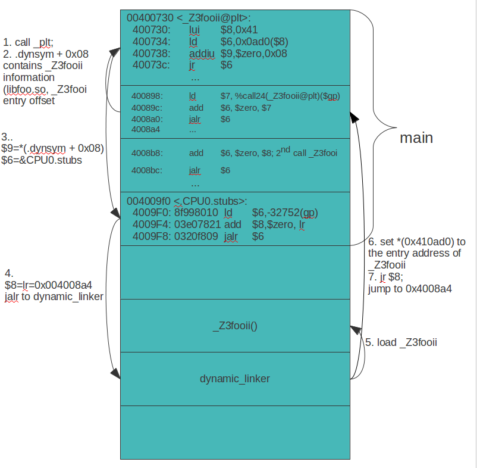

.. _sec-elf:

ELF Support
===========

Cpu0 backend generated the ELF format of obj. 
The ELF (Executable and Linkable Format) is a common standard file format for 
executables, object code, shared libraries and core dumps. 
First published in the System V Application Binary Interface specification, 
and later in the Tool Interface Standard, it was quickly accepted among 
different vendors of Unixsystems. 
In 1999 it was chosen as the standard binary file format for Unix and 
Unix-like systems on x86 by the x86open project. 
Please reference [#]_.

The binary encode of cpu0 instruction set in obj has been checked in the 
previous chapters. 
But we didn't dig into the ELF file format like elf header and relocation 
record at that time. 
This chapter will use the binutils which has been installed in 
"sub-section Install other tools on iMac" of Appendix A: “Installing LLVM” 
[#]_ to analysis cpu0 ELF file. 
You will learn the objdump, readelf, ..., tools and understand the ELF file 
format itself through using these tools to analyze the cpu0 generated obj in 
this chapter. 
LLVM has the llvm-objdump tool which like objdump. We will make cpu0 support 
llvm-objdump tool in this chapter. 
The binutils support other CPU ELF dump as a cross compiler tool chains. 
Linux platform has binutils already and no need to install it further.
We use Linux binutils in this chapter just because iMac will display Chinese 
text. 
The iMac corresponding binutils have no problem except it use add g in command. 
For example, use gobjdump instead of objdump, and display with your area 
language instead of pure English.

The binutils tool we use is not a part of llvm tools, but it's a powerful tool 
in ELF analysis. 
This chapter introduce the tool to readers since we think it is a valuable 
knowledge in this popular ELF format and the ELF binutils analysis tool. 
An LLVM compiler engineer has the responsibility to analyze the ELF since 
the obj is need to be handled by linker or loader later. 
With this tool, you can verify your generated ELF format.
 
The cpu0 author has published a “System Software” book which introduce the 
topics 
of assembler, linker, loader, compiler and OS in concept, and at same time 
demonstrate how to use binutils and gcc to analysis ELF through the example 
code in his book. 
It's a Chinese book of “System Software” in concept and practice. 
This book does the real analysis through binutils. 
The “System Software” [#]_ written by Beck is a famous book in concept of 
telling readers what is the compiler output, what is the linker output, 
what is the loader output, and how they work together. 
But it covers the concept only. 
You can reference it to understand how the **“Relocation Record”** works if you 
need to refresh or learning this knowledge for this chapter.

[#]_, [#]_, [#]_ are the Chinese documents available from the cpu0 author on 
web site.

ELF format
-----------

ELF is a format used both in obj and executable file. 
So, there are two views in it as :num:`Figure #elf-f1`.

.. _elf-f1:
.. figure:: ../Fig/elf/1.png
    :height: 320 px
    :width: 213 px
    :scale: 100 %
    :align: center

    ELF file format overview

As :num:`Figure #elf-f1`, the “Section header table” include sections .text, .rodata, 
..., .data which are sections layout for code, read only data, ..., and 
read/write data. 
“Program header table” include segments include run time code and data. 
The definition of segments is run time layout for code and data while sections 
is link time layout for code and data.

ELF header and Section header table
------------------------------------

Let's run Chapter9_4/ with ch6_1.cpp, and dump ELF header information by 
``readelf -h`` to see what information the ELF header contains.

.. code-block:: bash

  [Gamma@localhost InputFiles]$ /usr/local/llvm/test/cmake_debug_build/
  bin/llc -march=cpu0 -relocation-model=pic -filetype=obj ch6_1.bc -o ch6_1.cpu0.o
  
  [Gamma@localhost InputFiles]$ readelf -h ch6_1.cpu0.o 
    Magic:   7f 45 4c 46 01 02 01 03 00 00 00 00 00 00 00 00 
    Class:                             ELF32
    Data:                              2's complement, big endian
    Version:                           1 (current)
    OS/ABI:                            UNIX - GNU
    ABI Version:                       0
    Type:                              REL (Relocatable file)
    Machine:                           <unknown>: 0xc9
    Version:                           0x1
    Entry point address:               0x0
    Start of program headers:          0 (bytes into file)
    Start of section headers:          176 (bytes into file)
    Flags:                             0x0
    Size of this header:               52 (bytes)
    Size of program headers:           0 (bytes)
    Number of program headers:         0
    Size of section headers:           40 (bytes)
    Number of section headers:         8
    Section header string table index: 5
  [Gamma@localhost InputFiles]$ 

  [Gamma@localhost InputFiles]$ /usr/local/llvm/test/cmake_debug_build/
  bin/llc -march=mips -relocation-model=pic -filetype=obj ch6_1.bc -o ch6_1.mips.o
  
  [Gamma@localhost InputFiles]$ readelf -h ch6_1.mips.o 
  ELF Header:
    Magic:   7f 45 4c 46 01 02 01 03 00 00 00 00 00 00 00 00 
    Class:                             ELF32
    Data:                              2's complement, big endian
    Version:                           1 (current)
    OS/ABI:                            UNIX - GNU
    ABI Version:                       0
    Type:                              REL (Relocatable file)
    Machine:                           MIPS R3000
    Version:                           0x1
    Entry point address:               0x0
    Start of program headers:          0 (bytes into file)
    Start of section headers:          200 (bytes into file)
    Flags:                             0x50001007, noreorder, pic, cpic, o32, mips32
    Size of this header:               52 (bytes)
    Size of program headers:           0 (bytes)
    Number of program headers:         0
    Size of section headers:           40 (bytes)
    Number of section headers:         9
    Section header string table index: 6
  [Gamma@localhost InputFiles]$ 

As above ELF header display, it contains information of magic number, version, 
ABI, ..., . The Machine field of cpu0 is unknown while mips is MIPSR3000. 
It is because cpu0 is not a popular CPU recognized by utility readelf. 
Let's check ELF segments information as follows,

.. code-block:: bash

  [Gamma@localhost InputFiles]$ readelf -l ch6_1.cpu0.o 
  
  There are no program headers in this file.
  [Gamma@localhost InputFiles]$ 

The result is in expectation because cpu0 obj is for link only, not for 
execution. 
So, the segments is empty. 
Check ELF sections information as follows. 
It contains offset and size information for every section.

.. code-block:: bash

  [Gamma@localhost InputFiles]$ readelf -S ch6_1.cpu0.o 
  There are 10 section headers, starting at offset 0xd4:
  
  Section Headers:
    [Nr] Name              Type            Addr     Off    Size   ES Flg Lk Inf Al
    [ 0]                   NULL            00000000 000000 000000 00      0   0  0
    [ 1] .text             PROGBITS        00000000 000034 000034 00  AX  0   0  4
    [ 2] .rel.text         REL             00000000 000310 000018 08      8   1  4
    [ 3] .data             PROGBITS        00000000 000068 000004 00  WA  0   0  4
    [ 4] .bss              NOBITS          00000000 00006c 000000 00  WA  0   0  4
    [ 5] .eh_frame         PROGBITS        00000000 00006c 000028 00   A  0   0  4
    [ 6] .rel.eh_frame     REL             00000000 000328 000008 08      8   5  4
    [ 7] .shstrtab         STRTAB          00000000 000094 00003e 00      0   0  1
    [ 8] .symtab           SYMTAB          00000000 000264 000090 10      9   6  4
    [ 9] .strtab           STRTAB          00000000 0002f4 00001b 00      0   0  1
  Key to Flags:
    W (write), A (alloc), X (execute), M (merge), S (strings)
    I (info), L (link order), G (group), T (TLS), E (exclude), x (unknown)
    O (extra OS processing required) o (OS specific), p (processor specific)
  [Gamma@localhost InputFiles]$ 

Relocation Record
------------------

The cpu0 backend translate global variable as follows,

.. code-block:: bash

  [Gamma@localhost InputFiles]$ clang -target mips-unknown-linux-gnu -c ch6_1.cpp 
  -emit-llvm -o ch6_1.bc
  [Gamma@localhost InputFiles]$ /usr/local/llvm/test/cmake_debug_build/
  bin/llc -march=cpu0 -relocation-model=pic -filetype=asm ch6_1.bc -o ch6_1.cpu0.s
  [Gamma@localhost InputFiles]$ cat ch6_1.cpu0.s 
    .section .mdebug.abi32
    .previous
    .file "ch6_1.bc"
    .text
    ...
    .cfi_startproc
    .frame  $sp,8,$lr
    .mask   0x00000000,0
    .set  noreorder
    .cpload $t9
    ...
    lui $2, %got_hi(gI)
    addu $2, $2, $gp
    ld $2, %got_lo(gI)($2)
    ...
    .type gI,@object              # @gI
    .data
    .globl  gI
    .align  2
  gI:
    .4byte  100                     # 0x64
    .size gI, 4
  
  
  [Gamma@localhost InputFiles]$ /usr/local/llvm/test/cmake_debug_build/
  bin/llc -march=cpu0 -relocation-model=pic -filetype=obj ch6_1.bc -o ch6_1.cpu0.o
  [Gamma@localhost InputFiles]$ objdump -s ch6_1.cpu0.o
  
  ch6_1.cpu0.o:     file format elf32-big
  
  Contents of section .text:
  // .cpload machine instruction
   0000 0fa00000 09aa0000 13aa6000 ........  ..............`.
   ...
   0020 002a0000 00220000 012d0000 09dd0008  .*..."...-......
   ...
  [Gamma@localhost InputFiles]$ Jonathan$ 
  
  [Gamma@localhost InputFiles]$ readelf -tr ch6_1.cpu0.o 
  There are 8 section headers, starting at offset 0xb0:

  Section Headers:
    [Nr] Name
         Type            Addr     Off    Size   ES   Lk Inf Al
         Flags
    [ 0] 
         NULL            00000000 000000 000000 00   0   0  0
         [00000000]: 
    [ 1] .text
         PROGBITS        00000000 000034 000044 00   0   0  4
         [00000006]: ALLOC, EXEC
    [ 2] .rel.text
         REL             00000000 0002a8 000020 08   6   1  4
         [00000000]: 
    [ 3] .data
         PROGBITS        00000000 000078 000008 00   0   0  4
         [00000003]: WRITE, ALLOC
    [ 4] .bss
         NOBITS          00000000 000080 000000 00   0   0  4
         [00000003]: WRITE, ALLOC
    [ 5] .shstrtab
         STRTAB          00000000 000080 000030 00   0   0  1
         [00000000]: 
    [ 6] .symtab
         SYMTAB          00000000 0001f0 000090 10   7   5  4
         [00000000]: 
    [ 7] .strtab
         STRTAB          00000000 000280 000025 00   0   0  1
         [00000000]: 

  Relocation section '.rel.text' at offset 0x2a8 contains 4 entries:
   Offset     Info    Type            Sym.Value  Sym. Name
  00000000  00000805 unrecognized: 5       00000000   _gp_disp
  00000004  00000806 unrecognized: 6       00000000   _gp_disp
  00000020  00000616 unrecognized: 16      00000004   gI
  00000028  00000617 unrecognized: 17      00000004   gI

  
  [Gamma@localhost InputFiles]$ readelf -tr ch6_1.mips.o 
  There are 9 section headers, starting at offset 0xc8:

  Section Headers:
    [Nr] Name
         Type            Addr     Off    Size   ES   Lk Inf Al
         Flags
    [ 0] 
         NULL            00000000 000000 000000 00   0   0  0
         [00000000]: 
    [ 1] .text
         PROGBITS        00000000 000034 000038 00   0   0  4
         [00000006]: ALLOC, EXEC
    [ 2] .rel.text
         REL             00000000 0002f8 000018 08   7   1  4
         [00000000]: 
    [ 3] .data
         PROGBITS        00000000 00006c 000008 00   0   0  4
         [00000003]: WRITE, ALLOC
    [ 4] .bss
         NOBITS          00000000 000074 000000 00   0   0  4
         [00000003]: WRITE, ALLOC
    [ 5] .reginfo
         MIPS_REGINFO    00000000 000074 000018 00   0   0  1
         [00000002]: ALLOC
    [ 6] .shstrtab
         STRTAB          00000000 00008c 000039 00   0   0  1
         [00000000]: 
    [ 7] .symtab
         SYMTAB          00000000 000230 0000a0 10   8   6  4
         [00000000]: 
    [ 8] .strtab
         STRTAB          00000000 0002d0 000025 00   0   0  1
         [00000000]: 

  Relocation section '.rel.text' at offset 0x2f8 contains 3 entries:
   Offset     Info    Type            Sym.Value  Sym. Name
  00000000  00000905 R_MIPS_HI16       00000000   _gp_disp
  00000004  00000906 R_MIPS_LO16       00000000   _gp_disp
  0000001c  00000709 R_MIPS_GOT16      00000004   gI

As depicted in `section Handle $gp register in PIC addressing mode`_, it 
translate **“.cpload %reg”** into the following.

.. code-block:: c++

  // Lower ".cpload $reg" to
  //  "lui   $gp, %hi(_gp_disp)"
  //  "addiu $gp, $gp, %lo(_gp_disp)"
  //  "addu  $gp, $gp, $t9"

The _gp_disp value is determined by loader. So, it's undefined in obj. 
You can find the Relocation Records for offset 0 and 4 of .text section 
referred to _gp_disp value. 
The offset 0 and 4 of .text section are instructions "lui $gp, %hi(_gp_disp)"
and "addiu $gp, $gp, %lo(_gp_disp)" which their corresponding obj 
encode are 0fa00000 and  09aa0000. 
The obj translate the %hi(_gp_disp) and %lo(_gp_disp) into 0 since when loader 
load this obj into memory, loader will know the _gp_disp value at run time and 
will update these two offset relocation records into the correct offset value. 
You can check if the cpu0 of %hi(_gp_disp) and %lo(_gp_disp) are correct by 
above mips Relocation Records of R_MIPS_HI(_gp_disp) and  R_MIPS_LO(_gp_disp) 
even though the cpu0 is not a CPU recognized by readelf utilitly. 
The instruction **“ld $2, %got(gI)($gp)”** is same since we don't know what the 
address of .data section variable will load to. 
So, translate the address to 0 and made a relocation record on 0x00000020 of 
.text section. Linker or Loader will change this address when this program is 
linked or loaded depend on the program is static link or dynamic link.

Cpu0 ELF related files
-----------------------

Files Cpu0ELFObjectWrite.cpp and Cpu0MC*.cpp are the files take care the obj 
format. 
Most obj code translation are defined by Cpu0InstrInfo.td and 
Cpu0RegisterInfo.td. 
With these td description, LLVM translate Cpu0 instruction into obj format 
automatically.

llvm-objdump
-------------

llvm-objdump -t -r
~~~~~~~~~~~~~~~~~~

In iMac, ``gobjdump -tr`` can display the information of relocation records 
like ``readelf -tr``. LLVM tool llvm-objdump is the same tool as objdump. 
Let's run gobjdump and llvm-objdump commands as follows to see the differences. 

.. code-block:: bash

  118-165-83-12:InputFiles Jonathan$ clang -target mips-unknown-linux-gnu -c 
  ch9_3.cpp -emit-llvm -o ch9_3.bc
  118-165-83-10:InputFiles Jonathan$ /Users/Jonathan/llvm/test/cmake_debug_build/
  bin/Debug/llc -march=cpu0 -relocation-model=pic -filetype=obj ch9_3.bc -o 
  ch9_3.cpu0.o

  118-165-78-12:InputFiles Jonathan$ gobjdump -t -r ch9_3.cpu0.o
  
  ch9_3.cpu0.o:     file format elf32-big

  SYMBOL TABLE:
  00000000 l    df *ABS*	00000000 ch9_3.bc
  00000000 l    d  .text	00000000 .text
  00000000 l    d  .data	00000000 .data
  00000000 l    d  .bss	00000000 .bss
  00000000 g     F .text	00000084 _Z5sum_iiz
  00000084 g     F .text	00000080 main
  00000000         *UND*	00000000 _gp_disp

  RELOCATION RECORDS FOR [.text]:
  OFFSET   TYPE              VALUE 
  00000084 UNKNOWN           _gp_disp
  00000088 UNKNOWN           _gp_disp
  000000e0 UNKNOWN           _Z5sum_iiz

  118-165-83-10:InputFiles Jonathan$ /Users/Jonathan/llvm/test/cmake_debug_build/
  bin/Debug/llvm-objdump -t -r ch9_3_3.cpu0.o
  
  ch9_3.cpu0.o:	file format ELF32-CPU0

  RELOCATION RECORDS FOR [.text]:
  132 R_CPU0_HI16 _gp_disp
  136 R_CPU0_LO16 _gp_disp
  224 R_CPU0_CALL16 _Z5sum_iiz

  SYMBOL TABLE:
  00000000 l    df *ABS*	00000000 ch9_3.bc
  00000000 l    d  .text	00000000 .text
  00000000 l    d  .data	00000000 .data
  00000000 l    d  .bss	00000000 .bss
  00000000 g     F .text	00000084 _Z5sum_iiz
  00000084 g     F .text	00000080 main
  00000000         *UND*	00000000 _gp_disp

The latter llvm-objdump can display the file format and relocation records 
information since we add the relocation records information in ELF.h as follows, 

.. rubric:: include/support/ELF.h
.. code-block:: c++

  // Machine architectures
  enum {
    ...
    EM_CPU0          = 201, // Document Write An LLVM Backend Tutorial For Cpu0
    ...
  }
  
  // include/object/ELF.h
  ...
  template<support::endianness target_endianness, bool is64Bits>
  error_code ELFObjectFile<target_endianness, is64Bits>
              ::getRelocationTypeName(DataRefImpl Rel,
                        SmallVectorImpl<char> &Result) const {
    ...
    switch (Header->e_machine) {
    case ELF::EM_CPU0:  // llvm-objdump -t -r
    switch (type) {
      LLVM_ELF_SWITCH_RELOC_TYPE_NAME(R_CPU0_NONE);
      LLVM_ELF_SWITCH_RELOC_TYPE_NAME(R_CPU0_16);
      LLVM_ELF_SWITCH_RELOC_TYPE_NAME(R_CPU0_32);
      LLVM_ELF_SWITCH_RELOC_TYPE_NAME(R_CPU0_REL32);
      LLVM_ELF_SWITCH_RELOC_TYPE_NAME(R_CPU0_24);
      LLVM_ELF_SWITCH_RELOC_TYPE_NAME(R_CPU0_HI16);
      LLVM_ELF_SWITCH_RELOC_TYPE_NAME(R_CPU0_LO16);
      LLVM_ELF_SWITCH_RELOC_TYPE_NAME(R_CPU0_GPREL16);
      LLVM_ELF_SWITCH_RELOC_TYPE_NAME(R_CPU0_LITERAL);
      LLVM_ELF_SWITCH_RELOC_TYPE_NAME(R_CPU0_GOT16);
      LLVM_ELF_SWITCH_RELOC_TYPE_NAME(R_CPU0_PC24);
      LLVM_ELF_SWITCH_RELOC_TYPE_NAME(R_CPU0_CALL16);
      LLVM_ELF_SWITCH_RELOC_TYPE_NAME(R_CPU0_GPREL32);
      LLVM_ELF_SWITCH_RELOC_TYPE_NAME(R_CPU0_SHIFT5);
      LLVM_ELF_SWITCH_RELOC_TYPE_NAME(R_CPU0_SHIFT6);
      LLVM_ELF_SWITCH_RELOC_TYPE_NAME(R_CPU0_64);
      LLVM_ELF_SWITCH_RELOC_TYPE_NAME(R_CPU0_GOT_DISP);
      LLVM_ELF_SWITCH_RELOC_TYPE_NAME(R_CPU0_GOT_PAGE);
      LLVM_ELF_SWITCH_RELOC_TYPE_NAME(R_CPU0_GOT_OFST);
      LLVM_ELF_SWITCH_RELOC_TYPE_NAME(R_CPU0_GOT_HI16);
      LLVM_ELF_SWITCH_RELOC_TYPE_NAME(R_CPU0_GOT_LO16);
      LLVM_ELF_SWITCH_RELOC_TYPE_NAME(R_CPU0_SUB);
      LLVM_ELF_SWITCH_RELOC_TYPE_NAME(R_CPU0_INSERT_A);
      LLVM_ELF_SWITCH_RELOC_TYPE_NAME(R_CPU0_INSERT_B);
      LLVM_ELF_SWITCH_RELOC_TYPE_NAME(R_CPU0_DELETE);
      LLVM_ELF_SWITCH_RELOC_TYPE_NAME(R_CPU0_HIGHER);
      LLVM_ELF_SWITCH_RELOC_TYPE_NAME(R_CPU0_HIGHEST);
      LLVM_ELF_SWITCH_RELOC_TYPE_NAME(R_CPU0_CALL_HI16);
      LLVM_ELF_SWITCH_RELOC_TYPE_NAME(R_CPU0_CALL_LO16);
      LLVM_ELF_SWITCH_RELOC_TYPE_NAME(R_CPU0_SCN_DISP);
      LLVM_ELF_SWITCH_RELOC_TYPE_NAME(R_CPU0_REL16);
      LLVM_ELF_SWITCH_RELOC_TYPE_NAME(R_CPU0_ADD_IMMEDIATE);
      LLVM_ELF_SWITCH_RELOC_TYPE_NAME(R_CPU0_PJUMP);
      LLVM_ELF_SWITCH_RELOC_TYPE_NAME(R_CPU0_RELGOT);
      LLVM_ELF_SWITCH_RELOC_TYPE_NAME(R_CPU0_JALR);
      LLVM_ELF_SWITCH_RELOC_TYPE_NAME(R_CPU0_TLS_DTPMOD32);
      LLVM_ELF_SWITCH_RELOC_TYPE_NAME(R_CPU0_TLS_DTPREL32);
      LLVM_ELF_SWITCH_RELOC_TYPE_NAME(R_CPU0_TLS_DTPMOD64);
      LLVM_ELF_SWITCH_RELOC_TYPE_NAME(R_CPU0_TLS_DTPREL64);
      LLVM_ELF_SWITCH_RELOC_TYPE_NAME(R_CPU0_TLS_GD);
      LLVM_ELF_SWITCH_RELOC_TYPE_NAME(R_CPU0_TLS_LDM);
      LLVM_ELF_SWITCH_RELOC_TYPE_NAME(R_CPU0_TLS_DTPREL_HI16);
      LLVM_ELF_SWITCH_RELOC_TYPE_NAME(R_CPU0_TLS_DTPREL_LO16);
      LLVM_ELF_SWITCH_RELOC_TYPE_NAME(R_CPU0_TLS_GOTTPREL);
      LLVM_ELF_SWITCH_RELOC_TYPE_NAME(R_CPU0_TLS_TPREL32);
      LLVM_ELF_SWITCH_RELOC_TYPE_NAME(R_CPU0_TLS_TPREL64);
      LLVM_ELF_SWITCH_RELOC_TYPE_NAME(R_CPU0_TLS_TPREL_HI16);
      LLVM_ELF_SWITCH_RELOC_TYPE_NAME(R_CPU0_TLS_TPREL_LO16);
      LLVM_ELF_SWITCH_RELOC_TYPE_NAME(R_CPU0_GLOB_DAT);
      LLVM_ELF_SWITCH_RELOC_TYPE_NAME(R_CPU0_COPY);
      LLVM_ELF_SWITCH_RELOC_TYPE_NAME(R_CPU0_JUMP_SLOT);
      LLVM_ELF_SWITCH_RELOC_TYPE_NAME(R_CPU0_NUM);
    default:
      res = "Unknown";
    }
    break;
    ...
    }
  
  
  template<support::endianness target_endianness, bool is64Bits>
  error_code ELFObjectFile<target_endianness, is64Bits>
              ::getRelocationValueString(DataRefImpl Rel,
                        SmallVectorImpl<char> &Result) const {
    ...
    case ELF::EM_CPU0:  // llvm-objdump -t -r
    res = symname;
    break;
    ...
  }
  
  template<support::endianness target_endianness, bool is64Bits>
  StringRef ELFObjectFile<target_endianness, is64Bits>
               ::getFileFormatName() const {
    switch(Header->e_ident[ELF::EI_CLASS]) {
    case ELF::ELFCLASS32:
    switch(Header->e_machine) {
    ...
    case ELF::EM_CPU0:  // llvm-objdump -t -r
      return "ELF32-CPU0";
    ...
  }
  
  template<support::endianness target_endianness, bool is64Bits>
  unsigned ELFObjectFile<target_endianness, is64Bits>::getArch() const {
    switch(Header->e_machine) {
    ...
    case ELF::EM_CPU0:  // llvm-objdump -t -r
    return (target_endianness == support::little) ?
         Triple::cpu0el : Triple::cpu0;
    ...
  }

llvm-objdump -d
~~~~~~~~~~~~~~~~

Run the last Chapter example code with command ``llvm-objdump -d`` for dump 
file from elf to hex as follows, 

.. code-block:: bash

  JonathantekiiMac:InputFiles Jonathan$ clang -target mips-unknown-linux-gnu -c 
  ch8_1_1.cpp -emit-llvm -o ch8_1_1.bc
  JonathantekiiMac:InputFiles Jonathan$ /Users/Jonathan/llvm/test/cmake_debug_
  build/bin/Debug/llc -march=cpu0 -relocation-model=pic -filetype=obj ch8_1_1.bc 
  -o ch8_1_1.cpu0.o
  JonathantekiiMac:InputFiles Jonathan$ /Users/Jonathan/llvm/test/cmake_debug_
  build/bin/Debug/llvm-objdump -d ch8_1_1.cpu0.o
  
  ch8_1_1.cpu0.o: file format ELF32-unknown
  
  Disassembly of section .text:error: no disassembler for target cpu0-unknown-
  unknown

To support llvm-objdump, the following code added to Chapter10_1/.

.. rubric:: lbdex/Chapter10_1/CMakeLists.txt
.. code-block:: c++

  tablegen(LLVM Cpu0GenDisassemblerTables.inc -gen-disassembler)
  ...
  
.. rubric:: lbdex/Chapter10_1/LLVMBuild.txt
.. code-block:: c++

  [common]
  subdirectories = Disassembler ...
  ...
  has_disassembler = 1
  ...
  
.. rubric:: lbdex/Chapter10_1/Cpu0InstrInfo.td
.. code-block:: c++

  class CmpInstr<bits<8> op, string instr_asm, 
           InstrItinClass itin, RegisterClass RC, RegisterClass RD, 
           bit isComm = 0>:
    FA<op, (outs RD:$rc), (ins RC:$ra, RC:$rb),
     !strconcat(instr_asm, "\t$ra, $rb"), [], itin> {
    ...
    let DecoderMethod = "DecodeCMPInstruction";
  }
  
  class CBranch<bits<8> op, string instr_asm, RegisterClass RC,
             list<Register> UseRegs>:
    FJ<op, (outs), (ins RC:$ra, brtarget:$addr),
         !strconcat(instr_asm, "\t$addr"),
         [], IIBranch> {
    ...
    let DecoderMethod = "DecodeBranchTarget";
  }
  
  let isBranch=1, isTerminator=1, isBarrier=1, imm16=0, hasDelaySlot = 1,
    isIndirectBranch = 1 in
  class JumpFR<bits<8> op, string instr_asm, RegisterClass RC>:
    FL<op, (outs), (ins RC:$ra),
     !strconcat(instr_asm, "\t$ra"), [(brind RC:$ra)], IIBranch> {
    let rb = 0;
    let imm16 = 0;
  }
  
  let isCall=1, hasDelaySlot=0 in {
    class JumpLink<bits<8> op, string instr_asm>:
    FJ<op, (outs), (ins calltarget:$target, variable_ops),
       !strconcat(instr_asm, "\t$target"), [(Cpu0JmpLink imm:$target)],
       IIBranch> {
       let DecoderMethod = "DecodeJumpAbsoluteTarget";
       }
  
  def JR      : JumpFR<0x2C, "ret", CPURegs>;
  
.. rubric:: lbdex/Chapter10_1/Disassembler/CMakeLists.txt
.. literalinclude:: ../lbdex/Chapter10_1/Disassembler/CMakeLists.txt
  
.. rubric:: lbdex/Chapter10_1/Disassembler/LLVMBuild.txt
.. literalinclude:: ../lbdex/Chapter10_1/Disassembler/LLVMBuild.txt

.. rubric:: lbdex/Chapter10_1/Disassembler/Cpu0Disassembler.cpp
.. literalinclude:: ../lbdex/Chapter10_1/Disassembler/Cpu0Disassembler.cpp
  

As above code, it add directory Disassembler for handling the obj to assembly 
code reverse translation. So, add Disassembler/Cpu0Disassembler.cpp and modify 
the CMakeList.txt and LLVMBuild.txt to build with directory Disassembler and 
enable the disassembler table generated by "has_disassembler = 1". 
Most of code is handled by the table of \*.td files defined. 
Not every instruction in \*.td can be disassembled without trouble even though 
they can be translated into assembly and obj successfully. 
For those cannot be disassembled, LLVM supply the **"let DecoderMethod"** 
keyword to allow programmers implement their decode function. 
In Cpu0 example, we define function DecodeCMPInstruction(), DecodeBranchTarget()
and DecodeJumpAbsoluteTarget() in Cpu0Disassembler.cpp and tell the LLVM table 
driven system by write **"let DecoderMethod = ..."** in the corresponding 
instruction definitions or ISD node of Cpu0InstrInfo.td. 
LLVM will call these DecodeMethod when user use Disassembler job in tools, like 
``llvm-objdump -d``.
You can check the comments above these DecodeMethod functions to see how it 
work.
For the CMP instruction, since there are 3 operand $rc, $ra and $rb occurs in 
CmpInstr<...>, and the assembler print $ra and $rb. 
LLVM table generate system will print operand 1 and 2 
($ra and $rb) in the table generated function printInstruction(). 
The operand 0 ($rc) didn't be printed in printInstruction() since assembly 
print $ra and $rb only. 
In the CMP decode function, we didn't decode shamt field because we 
don't want it to be displayed and it's not in the assembler print pattern of 
Cpu0InstrInfo.td.

The RET (Cpu0ISD::Ret) and JR (ISD::BRIND) are both for "ret" instruction. 
The former is for instruction encode in assembly and obj while the latter is 
for decode in disassembler. 
The IR node Cpu0ISD::Ret is created in LowerReturn() which called at function 
exit point.

Now, run Chapter10_1/ with command ``llvm-objdump -d ch8_1_1.cpu0.o`` will get 
the following result.

.. code-block:: bash

  JonathantekiiMac:InputFiles Jonathan$ /Users/Jonathan/llvm/test/cmake_debug_
  build/bin/Debug/llc -march=cpu0 -relocation-model=pic -filetype=obj 
  ch8_1_1.bc -o ch8_1_1.cpu0.o
  JonathantekiiMac:InputFiles Jonathan$ /Users/Jonathan/llvm/test/cmake_debug_
  build/bin/Debug/llvm-objdump -d ch8_1_1.cpu0.o
  
  ch8_1_1.cpu0.o:	file format ELF32-CPU0

  Disassembly of section .text:
  _Z13test_control1v:
  _Z13test_control1v:
           0: 09 dd ff d0                                   addiu $sp, $sp, -48
           4: 02 cd 00 2c                                   st  $fp, 44($sp)
           8: 11 cd 00 00                                   addu  $fp, $sp, $zero
           c: 09 30 00 00                                   addiu $3, $zero, 0
          10: 02 3c 00 28                                   st  $3, 40($fp)
          14: 09 20 00 01                                   addiu $2, $zero, 1
          18: 02 2c 00 24                                   st  $2, 36($fp)
          1c: 09 40 00 02                                   addiu $4, $zero, 2
          20: 02 4c 00 20                                   st  $4, 32($fp)
          24: 09 40 00 03                                   addiu $4, $zero, 3
          28: 02 4c 00 1c                                   st  $4, 28($fp)
          2c: 09 40 00 04                                   addiu $4, $zero, 4
          30: 02 4c 00 18                                   st  $4, 24($fp)
          34: 09 40 00 05                                   addiu $4, $zero, 5
          38: 02 4c 00 14                                   st  $4, 20($fp)
          3c: 09 40 00 06                                   addiu $4, $zero, 6
          40: 02 4c 00 10                                   st  $4, 16($fp)
          44: 09 40 00 07                                   addiu $4, $zero, 7
          48: 02 4c 00 0c                                   st  $4, 12($fp)
          4c: 09 40 00 08                                   addiu $4, $zero, 8
          50: 02 4c 00 08                                   st  $4, 8($fp)
          54: 09 40 00 09                                   addiu $4, $zero, 9
          58: 02 4c 00 04                                   st  $4, 4($fp)
          5c: 01 4c 00 28                                   ld  $4, 40($fp)
          60: 10 43 00 00                                   cmp $zero, $4, $3
          64: 31 00 00 10                                   jne $zero, 16
          68: 36 00 00 00                                   jmp 0
          6c: 01 4c 00 28                                   ld  $4, 40($fp)
          70: 09 44 00 01                                   addiu $4, $4, 1
          74: 02 4c 00 28                                   st  $4, 40($fp)
          78: 01 4c 00 24                                   ld  $4, 36($fp)
          7c: 10 43 00 00                                   cmp $zero, $4, $3
          80: 30 00 00 10                                   jeq $zero, 16
          84: 36 00 00 00                                   jmp 0
          88: 01 4c 00 24                                   ld  $4, 36($fp)
          8c: 09 44 00 01                                   addiu $4, $4, 1
          90: 02 4c 00 24                                   st  $4, 36($fp)
          94: 01 4c 00 20                                   ld  $4, 32($fp)
          98: 10 42 00 00                                   cmp $zero, $4, $2
          9c: 32 00 00 10                                   jlt $zero, 16
          a0: 36 00 00 00                                   jmp 0
          a4: 01 4c 00 20                                   ld  $4, 32($fp)
          a8: 09 44 00 01                                   addiu $4, $4, 1
          ac: 02 4c 00 20                                   st  $4, 32($fp)
          b0: 01 4c 00 1c                                   ld  $4, 28($fp)
          b4: 10 43 00 00                                   cmp $zero, $4, $3
          b8: 32 00 00 10                                   jlt $zero, 16
          bc: 36 00 00 00                                   jmp 0
          c0: 01 4c 00 1c                                   ld  $4, 28($fp)
          c4: 09 44 00 01                                   addiu $4, $4, 1
          c8: 02 4c 00 1c                                   st  $4, 28($fp)
          cc: 09 40 ff ff                                   addiu $4, $zero, -1
          d0: 01 5c 00 18                                   ld  $5, 24($fp)
          d4: 10 54 00 00                                   cmp $zero, $5, $4
          d8: 33 00 00 10                                   jgt $zero, 16
          dc: 36 00 00 00                                   jmp 0
          e0: 01 4c 00 18                                   ld  $4, 24($fp)
          e4: 09 44 00 01                                   addiu $4, $4, 1
          e8: 02 4c 00 18                                   st  $4, 24($fp)
          ec: 01 4c 00 14                                   ld  $4, 20($fp)
          f0: 10 43 00 00                                   cmp $zero, $4, $3
          f4: 33 00 00 10                                   jgt $zero, 16
          f8: 36 00 00 00                                   jmp 0
          fc: 01 3c 00 14                                   ld  $3, 20($fp)
         100: 09 33 00 01                                   addiu $3, $3, 1
         104: 02 3c 00 14                                   st  $3, 20($fp)
         108: 01 3c 00 10                                   ld  $3, 16($fp)
         10c: 10 32 00 00                                   cmp $zero, $3, $2
         110: 33 00 00 10                                   jgt $zero, 16
         114: 36 00 00 00                                   jmp 0
         118: 01 3c 00 10                                   ld  $3, 16($fp)
         11c: 09 33 00 01                                   addiu $3, $3, 1
         120: 02 3c 00 10                                   st  $3, 16($fp)
         124: 01 3c 00 0c                                   ld  $3, 12($fp)
         128: 10 32 00 00                                   cmp $zero, $3, $2
         12c: 32 00 00 10                                   jlt $zero, 16
         130: 36 00 00 00                                   jmp 0
         134: 01 2c 00 0c                                   ld  $2, 12($fp)
         138: 09 22 00 01                                   addiu $2, $2, 1
         13c: 02 2c 00 0c                                   st  $2, 12($fp)
         140: 01 2c 00 0c                                   ld  $2, 12($fp)
         144: 01 3c 00 08                                   ld  $3, 8($fp)
         148: 10 32 00 00                                   cmp $zero, $3, $2
         14c: 35 00 00 10                                   jge $zero, 16
         150: 36 00 00 00                                   jmp 0
         154: 01 2c 00 08                                   ld  $2, 8($fp)
         158: 09 22 00 01                                   addiu $2, $2, 1
         15c: 02 2c 00 08                                   st  $2, 8($fp)
         160: 01 2c 00 24                                   ld  $2, 36($fp)
         164: 01 3c 00 28                                   ld  $3, 40($fp)
         168: 10 32 00 00                                   cmp $zero, $3, $2
         16c: 30 00 00 10                                   jeq $zero, 16
         170: 36 00 00 00                                   jmp 0
         174: 01 2c 00 04                                   ld  $2, 4($fp)
         178: 09 22 00 01                                   addiu $2, $2, 1
         17c: 02 2c 00 04                                   st  $2, 4($fp)
         180: 01 2c 00 24                                   ld  $2, 36($fp)
         184: 01 3c 00 28                                   ld  $3, 40($fp)
         188: 11 23 20 00                                   addu  $2, $3, $2
         18c: 01 3c 00 20                                   ld  $3, 32($fp)
         190: 11 22 30 00                                   addu  $2, $2, $3
         194: 01 3c 00 1c                                   ld  $3, 28($fp)
         198: 11 22 30 00                                   addu  $2, $2, $3
         19c: 01 3c 00 18                                   ld  $3, 24($fp)
         1a0: 11 22 30 00                                   addu  $2, $2, $3
         1a4: 01 3c 00 14                                   ld  $3, 20($fp)
         1a8: 11 22 30 00                                   addu  $2, $2, $3
         1ac: 01 3c 00 10                                   ld  $3, 16($fp)
         1b0: 11 22 30 00                                   addu  $2, $2, $3
         1b4: 01 3c 00 0c                                   ld  $3, 12($fp)
         1b8: 11 22 30 00                                   addu  $2, $2, $3
         1bc: 01 3c 00 08                                   ld  $3, 8($fp)
         1c0: 11 22 30 00                                   addu  $2, $2, $3
         1c4: 01 3c 00 04                                   ld  $3, 4($fp)
         1c8: 11 22 30 00                                   addu  $2, $2, $3
         1cc: 11 dc 00 00                                   addu  $sp, $fp, $zero
         1d0: 01 cd 00 2c                                   ld  $fp, 44($sp)
         1d4: 09 dd 00 30                                   addiu $sp, $sp, 48
         1d8: 3c e0 00 00                                   ret $lr

Dynamic link
-------------

We expain how the dynamic link work for Cpu0 even though the Cpu0 linker and 
dynamic linker not exist at this point. Same with other parts, Cpu0 dynamic link 
implementation borrowed from Mips ABI. We trace the dynamic link implementation 
by lldb on X86 platform. Finding X86 and Mips all use the plt as the dynamic link 
implementation. 

Linker support
~~~~~~~~~~~~~~~

In this section, it shows what's the code that comipler generate to support 
dynamic link. And what's the code generated by linker for dyanmic link.

Compile main.cpp to get the Cpu0 PIC assembly code as follows,

.. rubric:: lbdex/InputFiles/main.cpp
.. literalinclude:: ../lbdex/InputFiles/main.cpp
    :start-after: /// start

.. code-block:: bash

  18-165-77-200:InputFiles Jonathan$ /Users/Jonathan/llvm/test/cmake_debug_build/
  bin/Debug/llc -march=cpu0 -relocation-model=pic -filetype=asm  main.bc -o -
	  .section .mdebug.abi32
	  .previous
	  .file	"main.bc"
	  .text
	  .globl	main
	  .align	2
	  .type	main,@function
	  .ent	main                    # @main
  main:
	  .cfi_startproc
	  .frame	$fp,40,$lr
	  .mask 	0x00004880,-4
	  .set	noreorder
	  .cpload	$t9
	  .set	nomacro
  # BB#0:                                 # %entry
	  addiu	$sp, $sp, -40
  $tmp3:
	  .cfi_def_cfa_offset 40
	  st	$lr, 36($sp)            # 4-byte Folded Spill
	  st	$fp, 32($sp)            # 4-byte Folded Spill
	  st	$7, 28($sp)             # 4-byte Folded Spill
  $tmp4:
	  .cfi_offset 14, -4
  $tmp5:
	  .cfi_offset 11, -8
  $tmp6:
	  .cfi_offset 7, -12
	  addu	$fp, $sp, $zero
  $tmp7:
	  .cfi_def_cfa_register 11
	  .cprestore	8
	  addiu	$2, $zero, 0
	  st	$2, 24($fp)
	  addiu	$2, $zero, 2
	  st	$2, 4($sp)
	  addiu	$2, $zero, 1
	  st	$2, 0($sp)
	  ld	$7, %call16(_Z3fooii)($gp)
	  add	$t9, $zero, $7
	  jalr	$t9
	  ld	$gp, 8($fp)
	  st	$2, 20($fp)
	  addiu	$2, $zero, 4
	  st	$2, 4($sp)
	  addiu	$2, $zero, 3
	  st	$2, 0($sp)
	  add	$t9, $zero, $7
	  jalr	$t9
	  ld	$gp, 8($fp)
	  ld	$3, 20($fp)
	  addu	$2, $3, $2
	  st	$2, 20($fp)
	  ld	$t9, %call16(_Z3barv)($gp)
	  jalr	$t9
	  ld	$gp, 8($fp)
	  ld	$3, 20($fp)
	  addu	$2, $3, $2
	  st	$2, 20($fp)
	  addu	$sp, $fp, $zero
	  ld	$7, 28($sp)             # 4-byte Folded Reload
	  ld	$fp, 32($sp)            # 4-byte Folded Reload
	  ld	$lr, 36($sp)            # 4-byte Folded Reload
	  addiu	$sp, $sp, 40
	  ret	$lr
	  .set	macro
	  .set	reorder
	  .end	main
  $tmp8:
	  .size	main, ($tmp8)-main
	  .cfi_endproc

  118-165-77-200:InputFiles Jonathan$ /Users/Jonathan/llvm/test/cmake_debug_build/
  bin/Debug/llc -march=cpu0 -relocation-model=pic -filetype=obj  main.bc -o 
  main.cpu0.o
  118-165-77-200:InputFiles Jonathan$ /Users/Jonathan/llvm/test/cmake_debug_build/
  bin/Debug/llvm-objdump -r main.cpu0.o 

  main.cpu0.o:	file format ELF32-CPU0

  RELOCATION RECORDS FOR [.text]:
  4 R_CPU0_LO16 _gp_disp
  52 R_CPU0_CALL16 _Z3fooii
  112 R_CPU0_CALL16 _Z3barv

  RELOCATION RECORDS FOR [.eh_frame]:
  28 R_CPU0_32 .text

Suppost we have the linker which support dynamic link of Cpu0. 
After linker, the plt for dynamic link function _Z5fooii and _Z3barv are 
solved and the ELF file looks like the following,

.. code-block:: bash

  SYMBOL TABLE:
  ...
  0040035c l    d  .dynsym	00000000              .dynsym
  ...

  Disassembly of section .plt:
  ...
  00400720 <_Z3barv@plt>:
    400720:	lui	$8,0x41
    400724:	ld	$t9,0x0acc($8)
    400738:	addiu	$9,$zero,0x18
    40073c:	jr	$t9
  
  00400730 <_Z3fooii@plt>:
    400730:	lui	$8,0x41
    400734:	ld	$t9,0x0ado($8)
    400738:	addiu	$9,$zero,0x08
    40073c:	jr	$t9
    ...
  004009f0 <.CPU0.stubs>:
    4009F0: 8f998010  ld	$t9,-32752(gp)
    4009F4: 03e07821 add	$8,$zero, lr
    4009F8: 0320f809  jalr	$t9

Principle
~~~~~~~~~~

To support dynamic link, Cpu0 set the protocal as Table registers changed for 
call dynamic link function _Z3fooii(). The .dynsym+0x08 include the dynamic 
link function information. Usually the information include which 
library and the offset value in this library. This information can be got and 
saved in ELF file in link time.

After the ELF is loaded to memory, it looks like :num:`Figure #elf-f2`

.. _elf-f2:

    Call dynamic function _Z3fooii() first time

.. table:: registers changed for call dynamic link function _Z3fooii()

  ===================================  ================================================  ========================================
  register/memory                      call _Z3fooii first time                          call _Z3fooii second time
  ===================================  ================================================  ========================================
  0x410ad0                             point to CPU0.stubs                               point to _Z3fooii
  .dynsym+0x08                         (libfoobar.so, offset, length) about _Z3fooii     useless
  -32752(gp)                           point to dynamic_linker                           useless
  $8                                   the next instruction of _Z3fooii()                useless
  $9                                   .dynsym+0x08                                      useless
  $t9 (at the end of _Z3fooii@plt)      point to CPU0.stubs0                              point to _Z3fooii
  $t9 (at the end of CPU0.stubs)        point to dynamic_linker                           useless
  ===================================  ================================================  ========================================

Explains it as follows,

1. As you can see, the first time of function call, a = foo(1,2), which is 
   implemented 
   by instructions "ld $7, %call16(_Z3fooii@plt)($gp)", "add $t9, $zero, $7" and 
   "jalr $t9". Remember, .dynsym+0x08 contains information (libfoobar.so, 
   offset, length) which is set by linker at link to dynamic shared library.
   After "jalr $t9", PC counter jump to "00400730 <_Z3fooii@plt>". 

2. The memory 0x410ad0 contents is the address of CPU0.stubs when the program, 
   main(), is loaded. 

3. After _Z3fooii@plt instructions executed, it jump to CPU0.stubs since $t9 = the 
   address of CPU0.stubs. Register $9 = the contents of address .dynsym+0x08 since
   it is set in step 1. 

4. After CPU0.stubs is executed, register $8 = 0x004008a4 which point to the 
   caller next instruction in step 1.

5. Dynamic linker looks into register $9 which value is 0x08. It ask OS for 
   the caller process address information of .dynsym + offset 0x08. This 
   address include information (libfoobar.so, offset, length). With this 
   information, dynamic linker knows where can get _Z3fooii function body. 
   Dynamic linker loads _Z3fooii() function body to an available 
   address where from asking OS. After load _Z3fooii(), it call _Z3fooii() and
   save and restore the registers $t9, $8, $9 and caller saved registers just 
   before and after call _Z3fooii().

6. After _Z3fooii() return, dynamic linker set the contents of address 0x410ad0 
   to the entry address of _Z3fooii in memory.

7. Dynamic linker execute jr $8. It jump to the next instruction of 
   "a = _Z3fooii();" in caller.

After the _Z3fooii() is called at second time, it looks like 
:num:`Figure #elf-f3`. It jump to _Z3fooii() directly in <_Z3fooii@plt> since 
the contents of address 0x410ad0 is changed to the memory address of _Z3fooii() 
at step 6 of :num:`Figure #elf-f2`. From now on, any call _Z3fooii() will
jump to _Z3fooii() directly from _Z3fooii@plt instructions.

.. _elf-f3:
.. figure:: ../Fig/elf/3.png
    :height: 788 px
    :width: 744 px
    :scale: 100 %
    :align: center

    Call dynamic function _Z3fooii() second time

According Mips Application Binary Interface (ABI), $t9 is register alias 
for $25 in Mips. The %t9 is the register 
used in jalr $25 for long distance function pointer (far subroutine call). 
Cpu0 use register $t9($6) as the $t9 ($25) register of Mips.
The jal %subroutine has 24 bits range of address offset relative to Program 
Counter (PC) while jalr has 32 bits address range in register size of 32 bits. 
One example of PIC mode is used in share library just like this example. 
Share library is re-entry code which can be loaded in different memory address 
decided on run time. The jalr make the implementation of dynamic link function 
easier and faster as above.

Trace with lldb
~~~~~~~~~~~~~~~~

We tracking the dynamic link on X86 as below. You can skip it if you have no 
interest or already know how to track it via lldb or gdb.
 
.. code-block:: bash

  118-165-77-200:InputFiles Jonathan$ clang -fPIC -g -c foobar.cpp 
  118-165-77-200:InputFiles Jonathan$ clang -shared -g foobar.o -o libfoobar.so 
  118-165-77-200:InputFiles Jonathan$ clang -g -c main.cpp
  118-165-77-200:InputFiles Jonathan$ clang -g main.o libfoobar.so 
  118-165-77-200:InputFiles Jonathan$ gobjdump -d main.o

  main.o:     fileformat mach-o-x86-64

  Disassembly of section .text:

  0000000000000000 <_main>:
     0:	55                   	push   %rbp
     1:	48 89 e5             	mov    %rsp,%rbp
     4:	48 83 ec 10          	sub    $0x10,%rsp
     8:	bf 01 00 00 00       	mov    $0x1,%edi
     d:	be 02 00 00 00       	mov    $0x2,%esi
    12:	c7 45 fc 00 00 00 00 	movl   $0x0,-0x4(%rbp)
    19:	e8 00 00 00 00       	callq  1e <_main+0x1e>
    1e:	bf 03 00 00 00       	mov    $0x3,%edi
    23:	be 04 00 00 00       	mov    $0x4,%esi
    28:	89 45 f8             	mov    %eax,-0x8(%rbp)
    2b:	e8 00 00 00 00       	callq  30 <_main+0x30>
    30:	8b 75 f8             	mov    -0x8(%rbp),%esi
    33:	01 c6                	add    %eax,%esi
    35:	89 75 f8             	mov    %esi,-0x8(%rbp)
    38:	e8 00 00 00 00       	callq  3d <_main+0x3d>
    3d:	8b 75 f8             	mov    -0x8(%rbp),%esi
    40:	01 c6                	add    %eax,%esi
    42:	89 75 f8             	mov    %esi,-0x8(%rbp)
    45:	8b 45 f8             	mov    -0x8(%rbp),%eax
    48:	48 83 c4 10          	add    $0x10,%rsp
    4c:	5d                   	pop    %rbp
    4d:	c3                   	retq   

  118-165-77-200:InputFiles Jonathan$ gobjdump -d a.out
  ...
  main.o:     fileformat mach-o-x86-64

  Disassembly of section .text:

  0000000100000ef0 <_main>:
     100000ef0:	55                   	push   %rbp
     100000ef1:	48 89 e5             	mov    %rsp,%rbp
     100000ef4:	48 83 ec 10          	sub    $0x10,%rsp
     100000ef8:	bf 01 00 00 00       	mov    $0x1,%edi
     100000efd:	be 02 00 00 00       	mov    $0x2,%esi
     100000f02:	c7 45 fc 00 00 00 00 	movl   $0x0,-0x4(%rbp)
     100000f09:	e8 36 00 00 00       	callq  100000f44 <__Z3fooii$stub>
     100000f0e:	bf 03 00 00 00       	mov    $0x3,%edi
     100000f13:	be 04 00 00 00       	mov    $0x4,%esi
     100000f18:	89 45 f8             	mov    %eax,-0x8(%rbp)
     100000f1b:	e8 24 00 00 00       	callq  100000f44 <__Z3fooii$stub>
     100000f20:	8b 75 f8             	mov    -0x8(%rbp),%esi
     100000f23:	01 c6                	add    %eax,%esi
     100000f25:	89 75 f8             	mov    %esi,-0x8(%rbp)
     100000f28:	e8 11 00 00 00       	callq  100000f3e <__Z3barv$stub>
     100000f2d:	8b 75 f8             	mov    -0x8(%rbp),%esi
     100000f30:	01 c6                	add    %eax,%esi
     100000f32:	89 75 f8             	mov    %esi,-0x8(%rbp)
     100000f35:	8b 45 f8             	mov    -0x8(%rbp),%eax
     100000f38:	48 83 c4 10          	add    $0x10,%rsp
     100000f3c:	5d                   	pop    %rbp
     100000f3d:	c3                   	retq   

  Disassembly of section __TEXT.__stubs:

  0000000100000f3e <__Z3barv$stub>:
     100000f3e:	ff 25 cc 00 00 00    	jmpq   *0xcc(%rip)        # 100001010 
     <__Z3barv$stub>

  0000000100000f44 <__Z3fooii$stub>:
     100000f44:	ff 25 ce 00 00 00    	jmpq   *0xce(%rip)        # 100001018 
     <__Z3fooii$stub>

  Disassembly of section __TEXT.__stub_helper:

  0000000100000f4c <__TEXT.__stub_helper>:
     100000f4c:	4c 8d 1d b5 00 00 00 	lea    0xb5(%rip),%r11        # 100001008 <>
     100000f53:	41 53                	push   %r11
     100000f55:	ff 25 a5 00 00 00    	jmpq   *0xa5(%rip)        # 100001000 
     <dyld_stub_binder$stub>
     100000f5b:	90                   	nop
     100000f5c:	68 00 00 00 00       	pushq  $0x0
     100000f61:	e9 e6 ff ff ff       	jmpq   100000f4c <__Z3fooii$stub+0x8>
     100000f66:	68 0f 00 00 00       	pushq  $0xf
     100000f6b:	e9 dc ff ff ff       	jmpq   100000f4c <__Z3fooii$stub+0x8>

  Disassembly of section __TEXT.__unwind_info:
     ...

  118-165-77-200:InputFiles Jonathan$ lldb a.out
  Current executable set to 'a.out' (x86_64).
  (lldb) run main
  Process 702 launched: '/Users/Jonathan/test/lbd/docs/BackendTutorial/
  lbdex/InputFiles/a.out' (x86_64)
  Process 702 exited with status = 15 (0x0000000f) 
  (lldb) b main
  Breakpoint 1: where = a.out`main + 25 at main.cpp:7, address = 0x0000000100000f09
  (lldb) target stop-hook add
  Enter your stop hook command(s).  Type 'DONE' to end.
  > disassemble --pc
  > DONE
  Stop hook #1 added.
  (lldb) run
  Process 705 launched: '/Users/Jonathan/test/lbd/docs/BackendTutorial/
  lbdex/InputFiles/a.out' (x86_64)
  dyld`_dyld_start:
  -> 0x7fff5fc01028:  popq   %rdi
     0x7fff5fc01029:  pushq  $0
     0x7fff5fc0102b:  movq   %rsp, %rbp
     0x7fff5fc0102e:  andq   $-16, %rsp
  Process 753 stopped
  * thread #1: tid = 0x1c03, 0x0000000100000f09 a.out`main + 25 at main.cpp:7, 
  stop reason = breakpoint 1.1
      frame #0: 0x0000000100000f09 a.out`main + 25 at main.cpp:7
     4   	
     5   	int main()
     6   	{
  -> 7   	  int a = foo(1, 2);
     8   	  a += foo(3, 4);
     9   	  a += bar();
     10  	  
  a.out`main + 25 at main.cpp:7:
  -> 0x100000f09:  callq  0x100000f44               ; symbol stub for: foo(int, int)
     0x100000f0e:  movl   $3, %edi
     0x100000f13:  movl   $4, %esi
     0x100000f18:  movl   %eax, -8(%rbp)
  (lldb) stepi
  Process 753 stopped
  * thread #1: tid = 0x1c03, 0x0000000100000f44 a.out`foo(int, int), stop reason 
  = instruction step into
      frame #0: 0x0000000100000f44 a.out`foo(int, int)
  a.out`symbol stub for: foo(int, int):
  -> 0x100000f44:  jmpq   *206(%rip)                ; (void *)0x0000000100000f66
  a.out`symbol stub for: foo(int, int):
  -> 0x100000f44:  jmpq   *206(%rip)                ; (void *)0x0000000100000f66
     0x100000f4a:  addb   %al, (%rax)
     0x100000f4c:  addb   %al, (%rax)
     0x100000f4e:  addb   %al, (%rax)
  (lldb) p $rip
  (unsigned long) $1 = 4294971204
  (lldb) memory read/4xw 4294971410
  0x100001012: 0x00010000 0x0f660000 0x00010000 0x00000000
  (lldb) stepi
  Process 859 stopped
  * thread #1: tid = 0x1c03, 0x0000000100000f66 a.out, stop reason = instruction 
      step into frame #0: 0x0000000100000f66 a.out
  -> 0x100000f66:  pushq  $15
     0x100000f6b:  jmpq   0x100000f4c
  -> 0x100000f66:  pushq  $15
     0x100000f6b:  jmpq   0x100000f4c
     0x100000f70:  addb   %al, (%rax)
     0x100000f72:  addb   %al, (%rax)
  ) stepistepi
  Process 859 stopped
  * thread #1: tid = 0x1c03, 0x0000000100000f6b a.out, stop reason = instruction 
      step into frame #0: 0x0000000100000f6b a.out
  -> 0x100000f6b:  jmpq   0x100000f4c
  -> 0x100000f6b:  jmpq   0x100000f4c
     0x100000f70:  addb   %al, (%rax)
     0x100000f72:  addb   %al, (%rax)
     0x100000f74:  addb   %al, (%rax)
  (lldb) stepi
  Process 859 stopped
  * thread #1: tid = 0x1c03, 0x0000000100000f4c a.out, stop reason = instruction 
      step into frame #0: 0x0000000100000f4c a.out
  -> 0x100000f4c:  leaq   181(%rip), %r11           ; (void *)0x0000000000000000
     0x100000f53:  pushq  %r11
     0x100000f55:  jmpq   *165(%rip)                ; (void *)0x00007fff978da878: 
     dyld_stub_binder
     0x100000f5b:  nop    
  -> 0x100000f4c:  leaq   181(%rip), %r11           ; (void *)0x0000000000000000
     0x100000f53:  pushq  %r11
     0x100000f55:  jmpq   *165(%rip)                ; (void *)0x00007fff978da878: 
     dyld_stub_binder
     0x100000f5b:  nop    
  (lldb) 
  Process 859 stopped
  * thread #1: tid = 0x1c03, 0x0000000100000f53 a.out, stop reason = instruction 
      step into frame #0: 0x0000000100000f53 a.out
  -> 0x100000f53:  pushq  %r11
     0x100000f55:  jmpq   *165(%rip)                ; (void *)0x00007fff978da878: 
     dyld_stub_binder
     0x100000f5b:  nop    
     0x100000f5c:  pushq  $0
  -> 0x100000f53:  pushq  %r11
     0x100000f55:  jmpq   *165(%rip)                ; (void *)0x00007fff978da878: 
     dyld_stub_binder
     0x100000f5b:  nop    
     0x100000f5c:  pushq  $0
  (lldb) 
  Process 859 stopped
  * thread #1: tid = 0x1c03, 0x0000000100000f55 a.out, stop reason = instruction 
      step into frame #0: 0x0000000100000f55 a.out
  -> 0x100000f55:  jmpq   *165(%rip)                ; (void *)0x00007fff978da878: 
     dyld_stub_binder
     0x100000f5b:  nop    
     0x100000f5c:  pushq  $0
     0x100000f61:  jmpq   0x100000f4c
  -> 0x100000f55:  jmpq   *165(%rip)                ; (void *)0x00007fff978da878: 
     dyld_stub_binder
     0x100000f5b:  nop    
     0x100000f5c:  pushq  $0
     0x100000f61:  jmpq   0x100000f4c
  (lldb) 
  Process 859 stopped
  * thread #1: tid = 0x1c03, 0x00007fff978da878 libdyld.dylib`dyld_stub_binder, 
      stop reason = instruction step into
      frame #0: 0x00007fff978da878 libdyld.dylib`dyld_stub_binder
  libdyld.dylib`dyld_stub_binder:
  -> 0x7fff978da878:  pushq  %rbp
     0x7fff978da879:  movq   %rsp, %rbp
     0x7fff978da87c:  subq   $192, %rsp
     0x7fff978da883:  movq   %rdi, (%rsp)
  libdyld.dylib`dyld_stub_binder:
  -> 0x7fff978da878:  pushq  %rbp
     0x7fff978da879:  movq   %rsp, %rbp
     0x7fff978da87c:  subq   $192, %rsp
     0x7fff978da883:  movq   %rdi, (%rsp)
  (lldb) cont
  Process 753 resuming
  Process 753 stopped
  * thread #1: tid = 0x1c03, 0x0000000100000f1b a.out`main + 43 at main.cpp:8, 
      stop reason = breakpoint 2.1
      frame #0: 0x0000000100000f1b a.out`main + 43 at main.cpp:8
     5   	int main()
     6   	{
     7   	  int a = foo(1, 2);
  -> 8   	  a += foo(3, 4);
     9   	  a += bar();
     10  	  
     11  	  return a;
  a.out`main + 43 at main.cpp:8:
  -> 0x100000f1b:  callq  0x100000f44               ; symbol stub for: foo(int, int)
     0x100000f20:  movl   -8(%rbp), %esi
     0x100000f23:  addl   %eax, %esi
     0x100000f25:  movl   %esi, -8(%rbp)
  (lldb) stepi
  Process 753 stopped
  * thread #1: tid = 0x1c03, 0x0000000100000f44 a.out`foo(int, int), stop reason = 
      instruction step into frame #0: 0x0000000100000f44 a.out`foo(int, int)
  a.out`symbol stub for: foo(int, int):
  -> 0x100000f44:  jmpq   *206(%rip)                ; (void *)0x0000000100003f20: 
     foo(int, int) at /Users/Jonathan/test/lbd/docs/BackendTutorial/LLVMBackendT
     utorialExampleCode/InputFiles/foobar.cpp:3
  a.out`symbol stub for: foo(int, int):
  -> 0x100000f44:  jmpq   *206(%rip)                ; (void *)0x0000000100003f20: 
     foo(int, int) at /Users/Jonathan/test/lbd/docs/BackendTutorial/LLVMBackendT
     utorialExampleCode/InputFiles/foobar.cpp:3
     0x100000f4a:  addb   %al, (%rax)
     0x100000f4c:  addb   %al, (%rax)
     0x100000f4e:  addb   %al, (%rax)
  (lldb) p $rip
  (unsigned long) $2 = 4294971204
  (lldb) memory read/4xw 4294971410
  0x100001012: 0x00010000 0x3f200000 0x00010000 0x00000000
  (lldb) stepi
  Process 753 stopped
  * thread #1: tid = 0x1c03, 0x0000000100003f20 libfoobar.so`foo(x1=0, x2=3) at 
      foobar.cpp:3, stop reason = instruction step into
      frame #0: 0x0000000100003f20 libfoobar.so`foo(x1=0, x2=3) at foobar.cpp:3
     1   	
     2   	int foo(int x1, int x2)
  -> 3   	{
     4   	  int sum = x1 + x2;
     5   	  
     6   	  return sum; 
  libfoobar.so`foo(int, int) at foobar.cpp:3:
  -> 0x100003f20:  pushq  %rbp
     0x100003f21:  movq   %rsp, %rbp
     0x100003f24:  movl   %edi, -4(%rbp)
     0x100003f27:  movl   %esi, -8(%rbp)
  (lldb) 

.. _section Handle $gp register in PIC addressing mode:
	http://jonathan2251.github.com/lbd/funccall.html#handle-gp-register-in-pic-addressing-mode

.. [#] http://en.wikipedia.org/wiki/Executable_and_Linkable_Format

.. [#] http://jonathan2251.github.com/lbd/install.html#install-other-tools-on-imac

.. [#] Leland Beck, System Software: An Introduction to Systems Programming. 

.. [#] http://ccckmit.wikidot.com/lk:aout

.. [#] http://ccckmit.wikidot.com/lk:objfile

.. [#] http://ccckmit.wikidot.com/lk:elf

